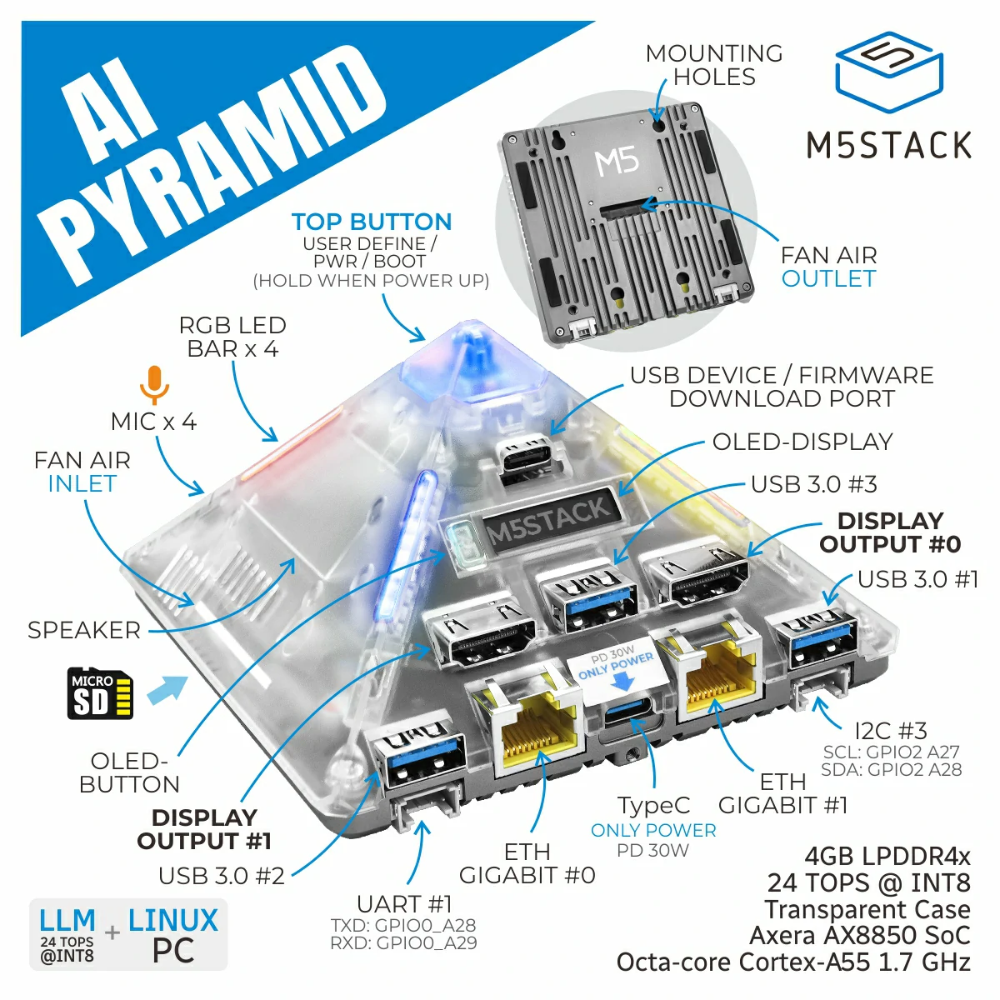
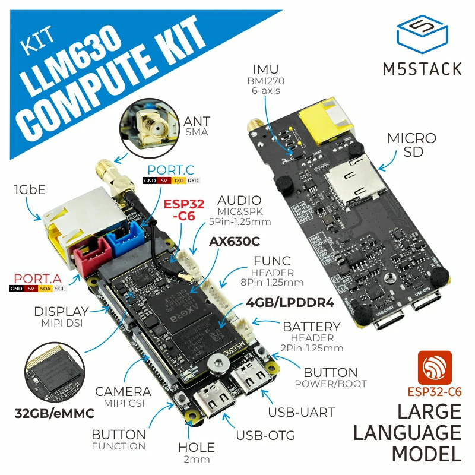
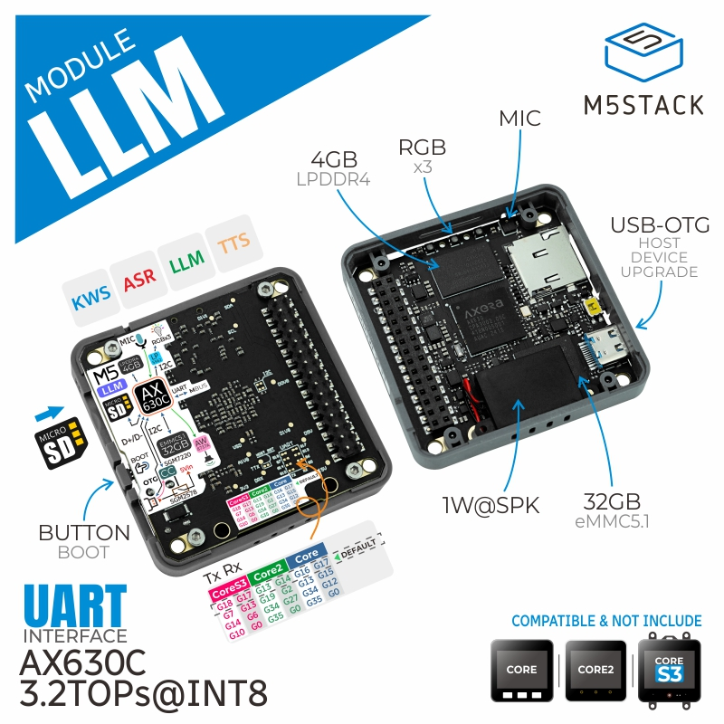

[English](./README_EN.md) | 简体中文

# AX-Samples

| Platform | Build Status |
| -------- | ------------ |
| AX650N   | |
| AX637    | |
| AX630C   | |
| AX620Q   | |

## 简介

**AX-Samples** 由 **[爱芯元智](https://www.axera-tech.com/)** 主导开发。该项目实现了常见的 **深度学习开源算法** 在 **爱芯元智** 的 **AI SoC** 上的示例代码，方便社区开发者进行快速评估和适配。 

### 已支持芯片

**终端计算芯片**
- [AX650A](https://www.axera-tech.com/zh-hans/product/2929.html) / [AX650N](https://www.axera-tech.com/zh-hans/product/2929.html)
- AX637
- [AX630C](https://www.axera-tech.com/zh-hans/product/2931.html) / [AX620Q](https://www.axera-tech.com/zh-hans/product/2932.html)
- [AX615](https://www.axera-tech.com/zh-hans/product/2956.html)

**车载芯片**
- [M57](https://www.axera-tech.com/zh-hans/product/2826.html)

**边缘计算芯片**
- [AX8850N](https://www.axera-tech.com/zh-hans/product/2897.html)/[AX8850](https://www.axera-tech.com/zh-hans/product/2896.html)

### 已支持开发板

| 开发板 | 图片 | 芯片 | 厂商 | 链接 |
| ------ | ---- | ---- | ---- | ---- |
| AXera-Pi Pro |  | AX650N | Sipeed | [Wiki](https://wiki.sipeed.com/m4ndock) |
| AI Pyramid |  | AX8850 | M5Stack | [文档](https://docs.m5stack.com/zh_CN/ai_hardware/AI_Pyramid) |
| LLM630 Compute Kit |  | AX630C | M5Stack | [文档](https://docs.m5stack.com/zh_CN/core/LLM630%20Compute%20Kit) |
| Module LLM |  | AX630C | M5Stack | [文档](https://docs.m5stack.com/zh_CN/module/Module-LLM) |

## 快速上手

### 编译

- [快速编译](docs/compile.md) 基于 cmake 实现简单的跨平台编译。

### 示例

- [examples](examples/) 提供常见分类、检测、姿态等深度学习开源算法和传统 CV 操作用例，根据 issue 需求持续更新。

### 网盘资源

- 提供 **ModelZoo**, **预编译程序**, **测试图片** 等内容:
  - [Huggingface](https://huggingface.co/collections/AXERA-TECH/vision-models-67b0bce92ddc61229e8e94ed)
  - [Modelscope](https://modelscope.cn/organization/AXERA-TECH)

### 速度评估

- [Benchmark](benchmark/) 常见开源模型推理耗时统计，基于 *AXera-Pi Pro* 实测。

## 关联项目

- NPU工具链在线文档，其中提供了NPU工具链相关使用说明和获取方式（更新不及时）
  - [Pulsar2在线文档](https://pulsar2-docs.readthedocs.io/zh_CN/latest/)(Support AX650A/AX650N/AX630C/AX620Q)
- 更推荐直接从下面获取最新 Pulsar2 工具链及文档
  - [Pulsar2 下载](https://huggingface.co/AXERA-TECH/Pulsar2)

## 技术讨论

- Github issues
- QQ 群: 139953715
