# examples

AX-Samples 将不断更新最流行的、实用的、有趣的示例代码。

- 物体分类
  - MobileNetv1
  - [MobileNetv2](#MobileNetv2)
  - MobileOne-s0
  - ResNet18
  - ResNet50
  - Others......
- 物体检测
  - [PP-YOLOv3](#yolov3paddle)
  - YOLOv3
  - YOLOv3-Tiny
  - YOLOv4
  - YOLOv4-Tiny
  - YOLOv4-Tiny-3l
  - [YOLOv5s](#YOLOv5s)
  - [YOLOv5-Lite](#YOLOv5-Lite)([original model](https://github.com/ppogg/YOLOv5-Lite))
  - [YOLOv7-Tiny](#YOLOv7-Tiny)
  - [YOLOX-S](#YOLOX-S)
  - YOLO-Fastest-XL
  - NanoDet
- 人型检测
  - YOLO-Fastest-Body
- 人脸检测
  - [scrfd](#Scrfd)
  - [YOLOv5-Face](#YOLOv5-Face)([original model](https://github.com/deepcam-cn/yolov5-face))
- 人脸分割
  - Face_Parsing
- 障碍物检测 (扫地机场景)
  - Robot-Obstacle-Detect
- 无人机视角物体检测
  - [YOLOv5s_visdrone](#YOLOv5s_visdrone)
- 3D单目车辆检测
  - [Monodlex](#Monodlex)
- 人体关键点
  - [HRNet](#HRNet)
  - [AX-POSE-PPL](#AX-POSE-PPL)
  - [HandPose](#HandPose)
- 人体分割
  - [PP-HumanSeg](#PP-HumanSeg)
- 语义分割
  - [PP-Seg](#MobileSeg)
- 传统 CV 操作
  - CropResize
- Pipeline 示例
  - NV12 -> CropResize -> NN(Classification)

## 运行示例

下面以物体分类、物体检测 两个常见任务说明如何在 AX620A 开发板上运行相关示例。

### 运行准备

登录 AX620A 开发板，在 `root` 路径下创建 `samples` 文件夹。

- 将 [快速编译](../docs/compile.md) 中编译生成的可执行示例拷贝到 `/root/samples/` 路径下；
- 将 **[ModelZoo](https://pan.baidu.com/s/1ZHW2P6Y3lPf2odmj3fo8hA?pwd=sow9)** 中相应的 **joint** 模型 `mobilenetv2.joint` 、 `yolov5s.joint` 拷贝到  `/root/samples/` 路径下；
- 将测试图片拷贝到 `/root/samples` 路径下。

```
/root/samples # ls -l
total 40644
-rwx--x--x    1 root     root       3805332 Mar 22 14:01 ax_classification
-rwx--x--x    1 root     root       3979652 Mar 22 14:01 ax_yolov5s
-rw-------    1 root     root        140391 Mar 22 10:39 cat.jpg
-rw-------    1 root     root        163759 Mar 22 14:01 dog.jpg
-rw-------    1 root     root       4299243 Mar 22 14:00 mobilenetv2.joint
-rw-------    1 root     root      29217004 Mar 22 14:04 yolov5s.joint
```

### 运行示例
#### MobileNetv2 
```
/root/samples # ./ax_classification -m mobilenetv2.joint -i cat.jpg -r 10
--------------------------------------
model file : mobilenetv2.joint
image file : cat.jpg
img_h, img_w : 224 224
Run-Joint Runtime version: 0.5.6
--------------------------------------
[INFO]: Virtual npu mode is 1_1

Tools version: 0.6.0.32
8a011dfa
10.6865, 285
10.3324, 283
9.1559, 281
9.1174, 356
9.0098, 282
--------------------------------------
Create handle took 201.32 ms (neu 6.36 ms, axe 0.00 ms, overhead 194.96 ms)
--------------------------------------
Repeat 10 times, avg time 3.43 ms, max_time 3.75 ms, min_time 3.37 ms
```

#### YOLOv5s
```
root@AXERA:~/samples# ./ax_yolov5s -m yolov5s.joint -i ssd_dog.jpg -r 10
--------------------------------------
model file : models/yolov5s.joint
image file : images/ssd_dog.jpg
img_h, img_w : 640 640
Run-Joint Runtime version: 0.5.10
--------------------------------------
[INFO]: Virtual npu mode is 1_1

Tools version: d696ee2f
run over: output len 3
--------------------------------------
Create handle took 488.94 ms (neu 22.83 ms, axe 0.00 ms, overhead 466.11 ms)
--------------------------------------
Repeat 10 times, avg time 22.54 ms, max_time 22.91 ms, min_time 22.47 ms
--------------------------------------
detection num: 3
16:  92%, [ 133,  221,  312,  541], dog
 2:  77%, [ 468,   76,  692,  171], car
 1:  65%, [ 167,  120,  564,  417], bicycle
```
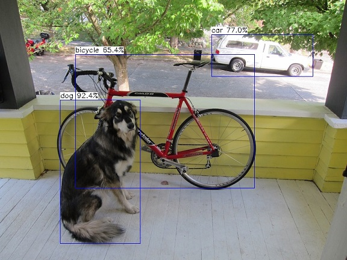

#### YOLOv5-Lite
```
root@AXERA:~/samples# ./ax_yolov5_lite -i cengiz-sari-X4spr8Kuwxc-unsplash.jpg -m ./models/v5Lite-g-sim-640.joint
--------------------------------------
model file : ./models/v5Lite-g-sim-640.joint
image file : cengiz-sari-X4spr8Kuwxc-unsplash.jpg
img_h, img_w : 640 640
[AX_SYS_LOG] AX_SYS_Log2ConsoleThread_Start
Run-Joint Runtime version: 0.5.10
--------------------------------------
[INFO]: Virtual npu mode is 1_1

Tools version: 0.6.1.20
07305a6
run over: output len 3
--------------------------------------
Create handle took 492.77 ms (neu 34.07 ms, axe 0.00 ms, overhead 458.70 ms)
--------------------------------------
Repeat 10 times, avg time 22.56 ms, max_time 22.97 ms, min_time 22.48 ms
--------------------------------------
detection num: 18
 0:  94%, [1866, 1142, 2485, 2806], person
 0:  92%, [2417, 1240, 2971, 2807], person
 0:  89%, [1356, 1234, 1762, 2432], person
 2:  88%, [2827, 1334, 3797, 2230], car
 2:  85%, [3385, 1416, 4031, 2852], car
 0:  84%, [ 895, 1276, 1281, 2424], person
 0:  78%, [ 747, 1278,  926, 1729], person
 0:  77%, [  25, 1254,  213, 1809], person
 0:  73%, [ 419, 1325,  585, 1780], person
 0:  71%, [ 247, 1316,  423, 1801], person
28:  64%, [ 729, 1812,  998, 2319], suitcase
 0:  61%, [ 610, 1421,  744, 1729], person
 2:  53%, [3808, 1353, 4031, 1502], car
 2:  50%, [2782, 1353, 2954, 1519], car
 0:  42%, [1167, 1204, 1325, 1572], person
 0:  39%, [1318, 1261, 1459, 1632], person
12:  38%, [1861, 1370, 1949, 1530], parking meter
 0:  35%, [ 171, 1305,  284, 1788], person
```
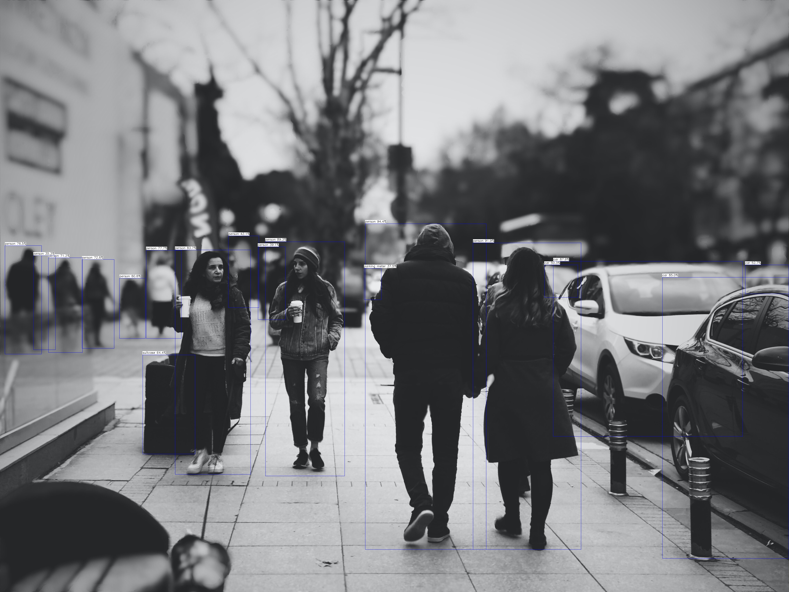

#### YOLOv5s_visdrone
```
root@AXERA:~/samples# ./ax_yolov5s_visdrone -m yolov5s_visdrone.joint -i visdrone.jpg -r 10
--------------------------------------
model file : yolov5s_visdrone.joint
image file : visdrone.jpg
img_h, img_w : 640 640
[AX_SYS_LOG] AX_SYS_Log2ConsoleThread_Start
Run-Joint Runtime version: 0.5.10
--------------------------------------
[INFO]: Virtual npu mode is 1_1

Tools version: 0.6.1.14
4111370
run over: output len 3
--------------------------------------
Create handle took 464.04 ms (neu 20.21 ms, axe 0.00 ms, overhead 443.83 ms)
--------------------------------------
Repeat 10 times, avg time 20.44 ms, max_time 20.83 ms, min_time 20.36 ms
--------------------------------------
detection num: 19
3:  89%, [ 949,  593, 1011,  683], car
3:  87%, [ 873,  570,  922,  663], car
3:  85%, [ 876,  702,  943,  813], car
3:  65%, [ 767,  293,  808,  329], car
3:  64%, [ 610,  362,  707,  415], car
3:  59%, [ 782,  244,  823,  286], car
9:  59%, [ 448,  556,  501,  591], motor
9:  52%, [ 364,  758,  414,  787], motor
9:  44%, [ 457,  522,  499,  553], motor
3:  43%, [ 783,  189,  811,  220], car
9:  43%, [ 678,  508,  734,  541], motor
1:  41%, [ 867,  318,  877,  343], people
1:  40%, [ 868,  406,  881,  439], people
9:  40%, [ 485,  456,  533,  482], motor
3:  38%, [ 758,  324,  824,  367], car
9:  37%, [ 735,  506,  774,  532], motor
1:  37%, [ 799,  513,  816,  550], people
1:  36%, [ 972,  793,  997,  843], people
9:  35%, [ 662,  466,  698,  495], motor
```
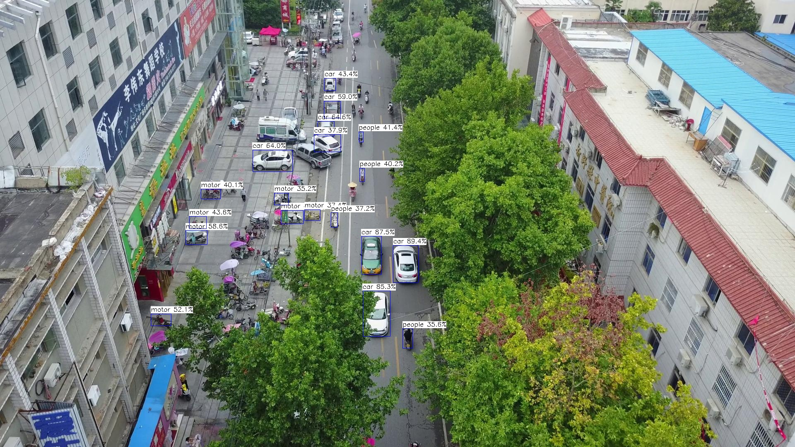

#### YOLOv7-Tiny
```
root@AXERA:~/samples# ./ax_yolov7 -m yolov7-tiny.joint -i ssd_dog.jpg -r 10
--------------------------------------
model file : yolov7-tiny-cut-sim-sigmoid-dfs.joint
image file : images/ssd_dog.jpg
img_h, img_w : 416 416
Run-Joint Runtime version: 0.5.10
--------------------------------------
[INFO]: Virtual npu mode is 1_1

Tools version: 0.6.1.4
59588c54
run over: output len 3
--------------------------------------
Create handle took 376.32 ms (neu 15.51 ms, axe 0.00 ms, overhead 360.81 ms)
--------------------------------------
Repeat 10 times, avg time 9.68 ms, max_time 10.01 ms, min_time 9.63 ms
--------------------------------------
detection num: 3
16:  88%, [ 133,  221,  316,  543], dog
 1:  86%, [ 139,  130,  571,  422], bicycle
 2:  63%, [ 468,   76,  691,  169], car
```
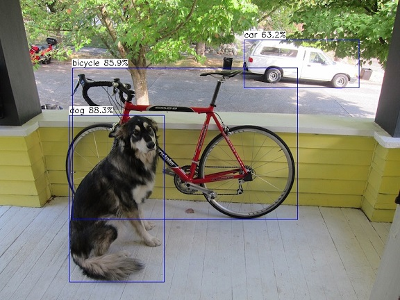

#### YOLOX-S
```
/tmp/samples # ./ax_yoloxs -m yolox_s_cut.joint -i dog.jpg -r 10
--------------------------------------
model file : yolox_s_cut.joint
image file : dog.jpg
img_h, img_w : 640 640
Run-Joint Runtime version: 0.5.8
--------------------------------------
[INFO]: Virtual npu mode is 1_1

Tools version: 0.6.0.32
8a011dfa
run over: output len 3
--------------------------------------
Create handle took 497.16 ms (neu 23.64 ms, axe 0.00 ms, overhead 473.52 ms)
--------------------------------------
Repeat 10 times, avg time 41.65 ms, max_time 42.37 ms, min_time 41.55 ms
--------------------------------------
detection num: 4
 1:  97%, [ 123,  119,  569,  417], bicycle
16:  95%, [ 136,  222,  307,  540], dog
 7:  72%, [ 470,   75,  688,  171], truck
58:  53%, [ 685,  111,  716,  154], potted plant
```

#### Scrfd
```
root@AXERA:~/samples# ./ax_scrfd -m scrfd_500m_bnkps_shape640x640.joint -i selfie.jpg -r 10
--------------------------------------
model file : models/scrfd_500m_bnkps_shape640x640.joint
image file : images/selfie.jpg
img_h, img_w : 640 640
Run-Joint Runtime version: 0.5.10
--------------------------------------
[INFO]: Virtual npu mode is 1_1

Tools version: 0.6.0.34
9c2b134d
run over: output len 9
--------------------------------------
Create handle took 68.89 ms (neu 4.43 ms, axe 0.00 ms, overhead 64.46 ms)
--------------------------------------
Repeat 10 times, avg time 5.76 ms, max_time 6.09 ms, min_time 5.71 ms
--------------------------------------
detection num: 111
```
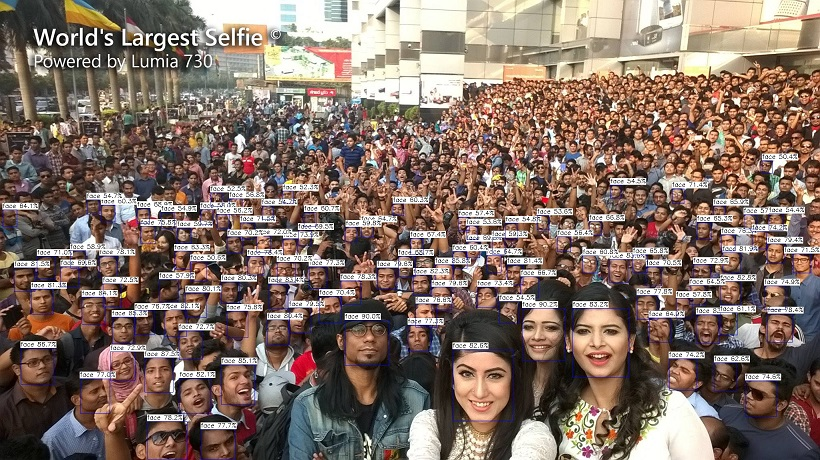

#### YOLOv5-Face
```
root@AXERA:~/samples# ./ax_yolov5s_face -m yolov5s-face.joint -i selfie.jpg -r 10
--------------------------------------
model file : yolov5s-face_sub.joint
image file : selfie.jpg
img_h, img_w : 640 640
[AX_SYS_LOG] AX_SYS_Log2ConsoleThread_Start
Run-Joint Runtime version: 0.5.10
--------------------------------------
[INFO]: Virtual npu mode is 1_1

Tools version: 0.6.1.20
07305a6
run over: output len 3
--------------------------------------
Create handle took 498.81 ms (neu 25.10 ms, axe 0.00 ms, overhead 473.71 ms)
--------------------------------------
Repeat 10 times, avg time 21.89 ms, max_time 22.31 ms, min_time 21.83 ms
--------------------------------------
detection num: 310
```
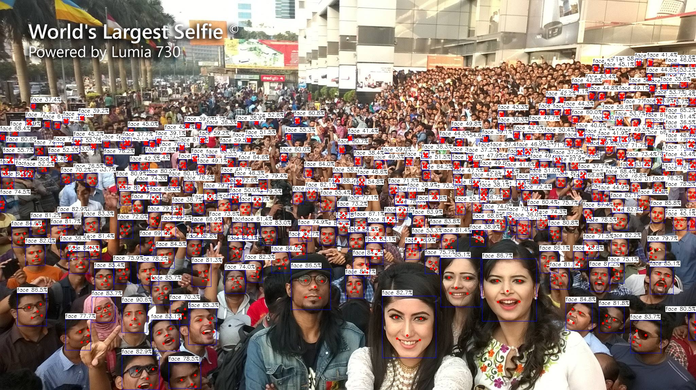

#### Monodlex
```
root@AXERA:~/samples# ./ax_monodlex -m monodlex_sigmoid_max.joint -i cityscape.png -r 10
--------------------------------------
model file : models/monodlex_sigmoid_max.joint
image file : images/cityscape.png
img_h, img_w : 384 1280
Run-Joint Runtime version: 0.5.10
--------------------------------------
[INFO]: Virtual npu mode is 1_1

Tools version: Unknown
run over: output len 8
--------------------------------------
Create handle took 628.84 ms (neu 29.80 ms, axe 0.00 ms, overhead 599.03 ms)
--------------------------------------
Repeat 10 times, avg time 111.77 ms, max_time 112.34 ms, min_time 111.66 ms
--------------------------------------
detection num: 7
```
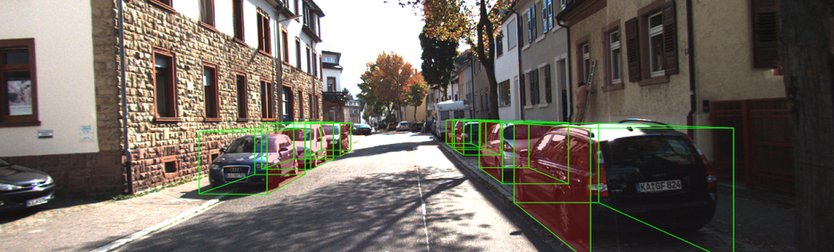

#### HRNet
```
root@AXERA:~/samples# ./ax_hrnet -m hrnet_256x192.joint -i pose-1.jpeg -r 10
--------------------------------------
model file : models/hrnet_256x192.joint
image file : images/pose-1.jpeg
img_h, img_w : 256 192
Run-Joint Runtime version: 0.5.10
--------------------------------------
[INFO]: Virtual npu mode is 1_1

Tools version: 0.6.0.30
100b6396
run over: output len 1
--------------------------------------
Create handle took 1385.15 ms (neu 25.64 ms, axe 0.00 ms, overhead 1359.51 ms)
--------------------------------------
Repeat 10 times, avg time 14.11 ms, max_time 14.64 ms, min_time 14.04 ms
--------------------------------------
```
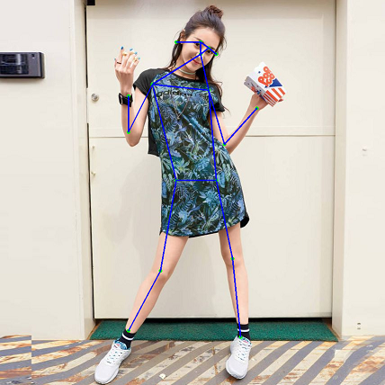

#### HRNet_animal
```
root@AXERA:~/samples# ./ax_hrnet -m hrnet_animal_256x256.joint -i ssd_horse.jpg -r 10
--------------------------------------
model file : models/hrnet_animal_256x256.joint
image file : images/ssd_horse.jpg
img_h, img_w : 256 256
Run-Joint Runtime version: 0.5.10
--------------------------------------
[INFO]: Virtual npu mode is 1_1

Tools version: 0.6.1.20
07305a6
run over: output len 1
--------------------------------------
Create handle took 1420.85 ms (neu 28.09 ms, axe 0.00 ms, overhead 1392.76 ms)
--------------------------------------
Repeat 10 times, avg time 17.49 ms, max_time 18.06 ms, min_time 17.40 ms
--------------------------------------
```
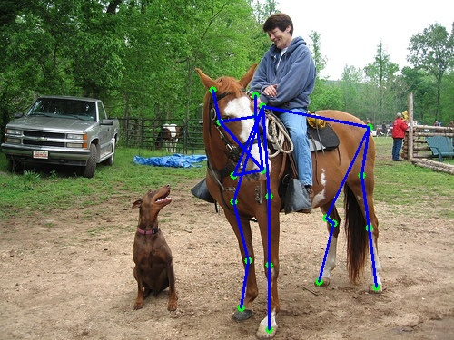

#### AX-POSE-PPL
```
root@AXERA:~/test# ./ax_pose_ppl -d ./models/ax_person_det.joint -p ./models/ax_pose.joint -i align_npu.jpg
--------------------------------------
relu_tiny25 p det model file : ./models/ax_person_det.joint
relu_tiny25 p det image file : align_npu.jpg
relu_tiny25 p det img_h, img_w : 512 288
[AX_SYS_LOG] AX_SYS_Log2ConsoleThread_Start
run crop_resize time cost avg: 8.835800 :ms
relu_tiny25 p det Run-Joint Runtime version: 0.5.10
--------------------------------------
[INFO]: Virtual npu mode is 1_1

relu_tiny25 p det Tools version: 0.6.0.30
100b6396
relu_tiny25 p det run over: output len 3
--------------------------------------
relu_tiny25 p det post_time_costs time cost: 1.86 ms
--------------------------------------
--------------------------------------
relu_tiny25 p det create handle took 142.63 ms (neu 5.09 ms, axe 0.00 ms, overhead 137.54 ms)
--------------------------------------
relu_tiny25 p det Repeat 1 times, avg time 4.51 ms, max_time 4.51 ms, min_time 4.51 ms
--------------------------------------
relu_tiny25 p det detection num: 1
 0:  86%, [ 281,    0,  503,  425], person
px 193py -53pw 398ph 531
need black px 193 py 0 pw 398 ph 426
fx 193 fy 0 fw 398 fh 426 --------------------------------------
pose pre_process time cost: 24.59 ms
--------------------------------------
[INFO]: Virtual npu mode is 1_1

pose Tools version: 0.6.1.14
4111370
pose run over: output len 2
x1: 368.271, y1: 77.7832
x1: 373.457, y1: 72.5977
x1: 363.086, y1: 72.5977
x1: 386.939, y1: 75.709
x1: 355.826, y1: 78.8203
x1: 406.645, y1: 114.082
x1: 363.086, y1: 122.379
x1: 446.055, y1: 148.307
x1: 343.381, y1: 159.715
x1: 445.018, y1: 160.752
x1: 308.119, y1: 177.346
x1: 428.424, y1: 214.682
x1: 400.422, y1: 214.682
x1: 431.535, y1: 288.316
x1: 372.42, y1: 277.945
x1: 473.02, y1: 359.877
x1: 404.57, y1: 343.283
--------------------------------------
pose post_time_costs time cost: 0.66 ms
--------------------------------------
--------------------------------------
pose Create handle took 904.05 ms (neu 19.85 ms, axe 0.00 ms, overhead 884.20 ms)
--------------------------------------
pose Repeat 1 times, avg time 8.95 ms, max_time 8.95 ms, min_time 8.95 ms
--------------------------------------
ax_pose_ppl.png
--------------------------------------
```
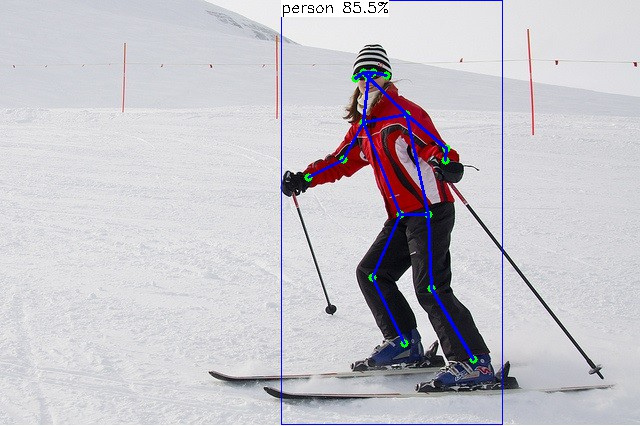

#### FaceParsing
```
root@AXERA:~/samples# ./ax_face_parsing -m ./face_parsing.joint -i ./face_parsing.jpg -r 10
--------------------------------------
model file : ./face_parsing.joint
image file : ./face_parsing.jpg
img_h, img_w : 512 512
[AX_SYS_LOG] AX_SYS_Log2ConsoleThread_Start
Run-Joint Runtime version: 0.5.10
--------------------------------------
[INFO]: Virtual npu mode is 1_1

Tools version: 0.6.1.14
4111370
--------------------------------------
Create handle took 683.64 ms (neu 20.54 ms, axe 0.00 ms, overhead 663.10 ms)
--------------------------------------
Repeat 10 times, avg time 49.38 ms, max_time 50.02 ms, min_time 49.29 ms
--------------------------------------
```
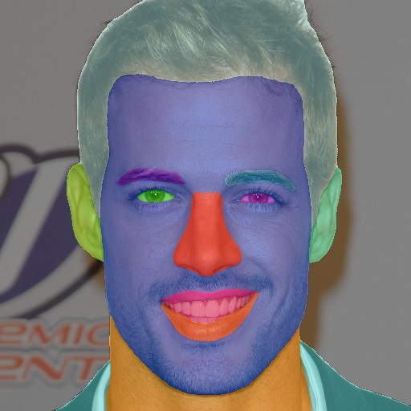

#### HandPose
```
root@AXERA:~/samples# ./ax_handpose -m ./handpose.joint -i ./hand.jpg -r 10
--------------------------------------
model file : ./handpose.joint
image file : ./hand.jpg
img_h, img_w : 224 224
[AX_SYS_LOG] AX_SYS_Log2ConsoleThread_Start
Run-Joint Runtime version: 0.5.10
--------------------------------------
[INFO]: Virtual npu mode is 1_1

Tools version: 0.6.1.14
4111370
run over: output len 2
--------------------------------------
Create handle took 298.99 ms (neu 15.22 ms, axe 0.00 ms, overhead 283.78 ms)
--------------------------------------
Repeat 10 times, avg time 10.00 ms, max_time 10.33 ms, min_time 9.95 ms
--------------------------------------
```
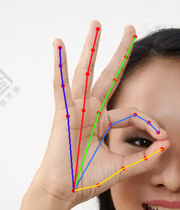

#### YOLOv5-Seg
```
root@AXERA:~/samples# ./ax_yolov5s_seg -m ./yolov5s-seg.joint -i ./seg.jpg -r 10
--------------------------------------
model file : ./yolov5s-seg.joint
image file : ./seg.jpg
img_h, img_w : 640 640
[AX_SYS_LOG] AX_SYS_Log2ConsoleThread_Start
Run-Joint Runtime version: 0.5.10
--------------------------------------
[INFO]: Virtual npu mode is 1_1

Tools version: 0.6.1.14
4111370
run over: output len 4
--------------------------------------
Create handle took 546.25 ms (neu 29.94 ms, axe 0.00 ms, overhead 516.31 ms)
--------------------------------------
Repeat 10 times, avg time 33.32 ms, max_time 33.71 ms, min_time 33.19 ms
--------------------------------------
detection num: 2
17:  93%, [ 119,  113,  485,  403], horse
 0:  82%, [ 229,   17,  333,  278], person
```
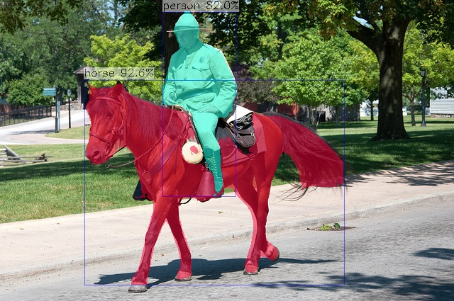

#### YOLOv5-License-plate
```
root@AXERA:~/samples# ./ax_yolov5s_license_plate -m ../models/license_plate_det.joint -i license_plate.png -g 640,384
--------------------------------------
model file : ../models/license_plate_det.joint
image file : license_plate.png
img_h, img_w : 640 384
[AX_SYS_LOG] AX_SYS_Log2ConsoleThread_Start
Run-Joint Runtime version: 0.5.10
--------------------------------------
[INFO]: Virtual npu mode is 1_1

Tools version: 0.6.1.26
6b66666
run over: output len 3
--------------------------------------
Create handle took 417.79 ms (neu 42.09 ms, axe 0.00 ms, overhead 375.70 ms)
--------------------------------------
Repeat 1 times, avg time 30.51 ms, max_time 30.51 ms, min_time 30.51 ms
--------------------------------------
detection num: 1
```
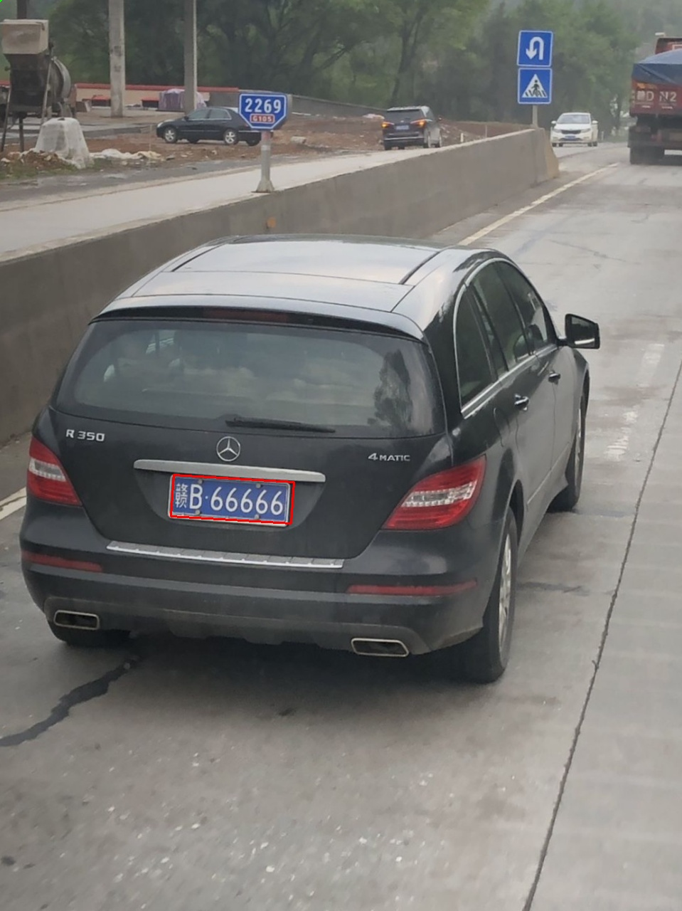

#### PalmDetection
```
root@AXERA:~/samples# ./ax_palm_detection -m ./palm_detection.joint -i ./img-7.jpg -r 10
--------------------------------------
model file : ./palm_detection.joint
image file : ./img-7.jpg
img_h, img_w : 192 192
[AX_SYS_LOG] AX_SYS_Log2ConsoleThread_Start
Run-Joint Runtime version: 0.5.10
--------------------------------------
[INFO]: Virtual npu mode is 1_1

Tools version: 0.6.1.14
4111370
run over: output len 2
--------------------------------------
Create handle took 248.70 ms (neu 15.28 ms, axe 13.81 ms, overhead 219.60 ms)
--------------------------------------
Repeat 10 times, avg time 20.46 ms, max_time 22.86 ms, min_time 20.11 ms
--------------------------------------
detection num: 2
```
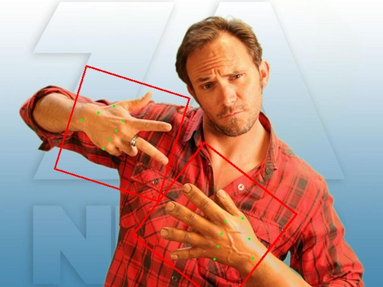

#### YOLOPv2
```
root@AXERA:~/samples# ./ax_yolopv2 -m ./yolopv2.joint -i ./img-1199.jpg -r 10
--------------------------------------
model file : ./yolopv2.joint
image file : ./img-1199.jpg
img_h, img_w : 288 480
[AX_SYS_LOG] AX_SYS_Log2ConsoleThread_Start
Run-Joint Runtime version: 0.5.10
--------------------------------------
[INFO]: Virtual npu mode is 1_1

Tools version: 0.6.1.20
07305a6
run over: output len 5
--------------------------------------
Create handle took 2406.15 ms (neu 116.83 ms, axe 0.00 ms, overhead 2289.33 ms)
--------------------------------------
Repeat 10 times, avg time 100.69 ms, max_time 101.74 ms, min_time 100.50 ms
--------------------------------------
detection num: 12
 3:  92%, [ 471,  273,  565,  346]
 3:  91%, [ 618,  289,  692,  347]
 3:  88%, [  72,  292,  225,  344]
 3:  85%, [ 230,  289,  293,  327]
 3:  79%, [ 281,  296,  350,  323]
 3:  79%, [ 551,  285,  594,  320]
 3:  75%, [   0,  307,   34,  353]
 3:  74%, [ 585,  279,  615,  308]
 3:  60%, [ 720,  278,  744,  298]
 3:  53%, [ 447,  262,  492,  309]
 3:  42%, [ 675,  275,  700,  300]
 3:  39%, [ 620,  278,  661,  302]
```
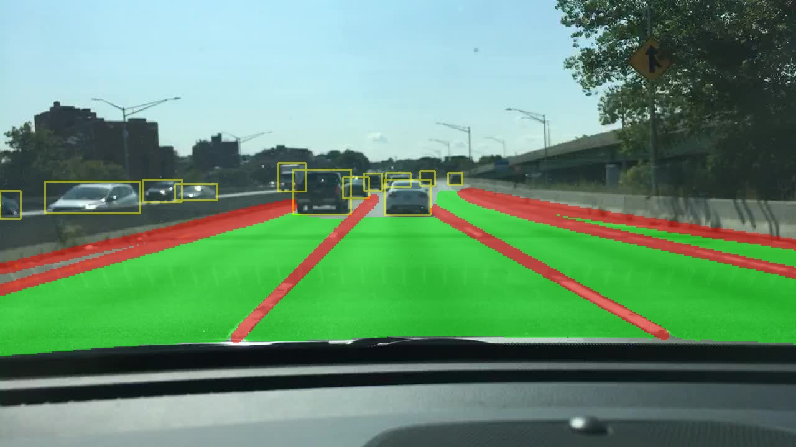

#### YOLOv7-Face
```
root@AXERA:~/samples# ./ax_yolov7s_face -m ./yolov7s-face.joint -i ./selfie.jpg -r 10
--------------------------------------
model file : ./yolov7s-face.joint
image file : ./selfie.jpg
img_h, img_w : 640 640
[AX_SYS_LOG] AX_SYS_Log2ConsoleThread_Start
Run-Joint Runtime version: 0.5.10
--------------------------------------
[INFO]: Virtual npu mode is 1_1

Tools version: 0.6.1.20
07305a6
run over: output len 3
--------------------------------------
Create handle took 481.47 ms (neu 31.83 ms, axe 0.00 ms, overhead 449.64 ms)
--------------------------------------
Repeat 10 times, avg time 25.46 ms, max_time 25.83 ms, min_time 25.39 ms
--------------------------------------
detection num: 217
```
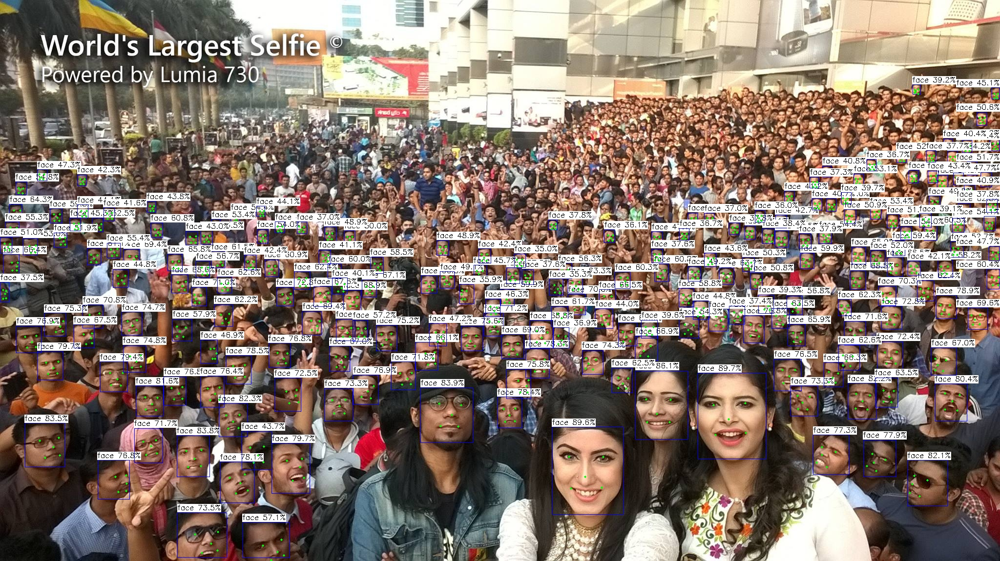

#### YOLOv7-Palm
```
root@AXERA:~/samples# ./ax_yolov7s_palm -m ./yolov7s-palm.joint -i ./img-7.jpg -r 10
--------------------------------------
model file : ./yolov7s-palm.joint
image file : ./img-7.jpg
img_h, img_w : 320 320
[AX_SYS_LOG] AX_SYS_Log2ConsoleThread_Start
Run-Joint Runtime version: 0.5.10
--------------------------------------
[INFO]: Virtual npu mode is 1_1

Tools version: 0.6.1.20
07305a6
run over: output len 3
--------------------------------------
Create handle took 335.46 ms (neu 14.35 ms, axe 0.00 ms, overhead 321.11 ms)
--------------------------------------
Repeat 10 times, avg time 7.65 ms, max_time 12.25 ms, min_time 7.11 ms
--------------------------------------
detection num: 2
```


#### YOLOv6s
```
root@AXERA:~/samples# ./ax_yolov6s -m ./yolov6s.joint -i ./image1.jpg -r 10
--------------------------------------
model file : ./yolov6s.joint
image file : ./image1.jpg
img_h, img_w : 640 640
[AX_SYS_LOG] AX_SYS_Log2ConsoleThread_Start
Run-Joint Runtime version: 0.5.10
--------------------------------------
[INFO]: Virtual npu mode is 1_1

Tools version: 0.6.1.14
4111370
run over: output len 3
--------------------------------------
Create handle took 853.99 ms (neu 18.95 ms, axe 0.00 ms, overhead 835.04 ms)
--------------------------------------
Repeat 10 times, avg time 32.42 ms, max_time 32.93 ms, min_time 32.35 ms
--------------------------------------
detection num: 3
 0:  95%, [   1,    2,  400,  530], person
 0:  90%, [ 291,   80,  635,  532], person
27:  84%, [ 195,  200,  254,  411], tie
```
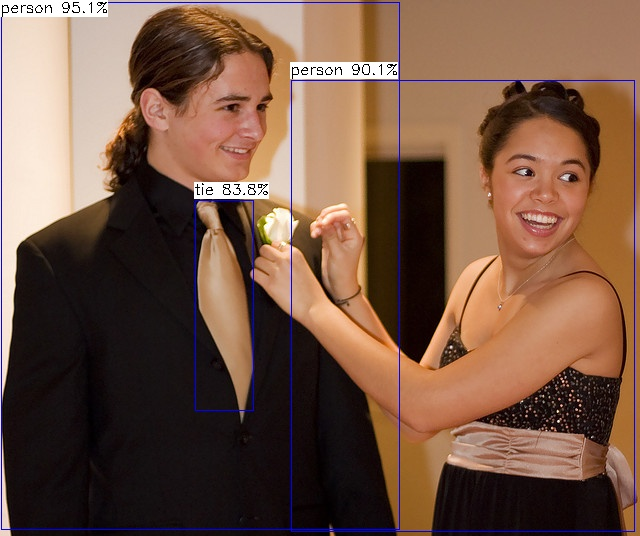

## 模型说明
### YOLOv3(Paddle)
YOLOv3(Paddle) 源自国内产业级深度学习开源框架飞桨的目标检测开发套件 [PaddleDetection](https://github.com/PaddlePaddle/PaddleDetection)，通过速度与精度权衡，我们选择基于 416尺度的 [YOLOv3-Res34](https://github.com/PaddlePaddle/PaddleDetection/tree/develop/configs/yolov3/) 进行功能展示。

#### Paddle2ONNX

- git clone https://github.com/PaddlePaddle/PaddleDetection.git
- 参考 PaddleDetection/deploy/EXPORT_ONNX_MODEL.md 导出 onnx 模型

#### ONNX2Joint

- 目前需通过 FAE 获取AI工具链进行尝试
- 可通过 ModelZoo 中预先转换好的 `yolov3-paddle-416.joint` 进行体验

#### Sample

```
root@AXERA:~/samples# ./ax_paddle_yolov3 -m yolov3_paddle.joint -i dog.jpg -r 10
--------------------------------------
model file : yolov3_paddle.joint
image file : dog.jpg
img_h, img_w : 416 416
Run-Joint Runtime version: 0.5.10
--------------------------------------
[INFO]: Virtual npu mode is 1_1

Tools version: 0.6.0.17
run over: output len 3
--------------------------------------
Create handle took 2079.12 ms (neu 38.63 ms, axe 0.00 ms, overhead 2040.49 ms)
--------------------------------------
Repeat 10 times, avg time 35.94 ms, max_time 36.59 ms, min_time 35.85 ms
--------------------------------------
detection num: 3
 1:  89%, [ 120,  126,  568,  432], bicycle
16:  57%, [ 126,  193,  312,  536], dog
 2:  54%, [ 453,   78,  686,  174], car
```


### MobileSeg
MobileSeg 源自国内产业级深度学习开源框架飞桨的高性能图像分割开发套件 [PaddleSeg](https://github.com/PaddlePaddle/PaddleSeg)，通过速度与精度权衡，我们选择基于 *MobileNetV2*  Backbone 的 [MobileSeg](https://github.com/PaddlePaddle/PaddleSeg/tree/release/2.6/configs/mobileseg/) 进行功能展示。

#### Paddle2ONNX

- git clone https://github.com/PaddlePaddle/PaddleDetection.git
- 参考 PaddleDetection/deploy/EXPORT_ONNX_MODEL.md 导出 onnx 模型

#### ONNX2Joint

- 目前需通过 FAE 获取AI工具链进行尝试
- 可通过 ModelZoo 中预先转换好的 `model_mv2seg_sim_cut_infer_argmax.joint` 进行体验

#### Sample

```
root@AXERA:~/samples# ./ax_paddle_mobileseg -m model_mv2seg_sim_cut_infer_argmax.joint -i mv2seg.png -r 10
--------------------------------------
model file : model_mv2seg_sim_cut_infer_argmax.joint
image file : mv2seg.png
img_h, img_w : 512 1024
Run-Joint Runtime version: 0.5.10
--------------------------------------
[INFO]: Virtual npu mode is 1_1

Tools version: Unknown
--------------------------------------
Create handle took 303.45 ms (neu 26.27 ms, axe 0.00 ms, overhead 277.19 ms)
--------------------------------------
Repeat 10 times, avg time 74.90 ms, max_time 76.26 ms, min_time 74.66 ms
```
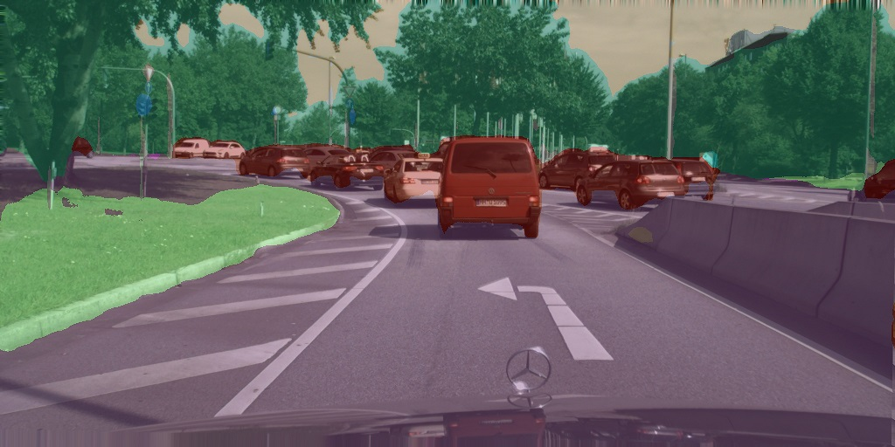

### PP-HumanSeg
PP-HumanSeg 源自国内产业级深度学习开源框架飞桨的高性能图像分割开发套件 [PaddleSeg](https://github.com/PaddlePaddle/PaddleSeg)，通过速度与精度权衡，我们选择  [PP-HumanSegV1-Mobile](https://github.com/PaddlePaddle/PaddleSeg/tree/release/2.6/contrib/PP-HumanSeg/) 进行功能展示。

#### Paddle2ONNX

- git clone https://github.com/PaddlePaddle/PaddleDetection.git
- 参考 PaddleDetection/deploy/EXPORT_ONNX_MODEL.md 导出 onnx 模型

#### ONNX2Joint

- 目前需通过 FAE 获取AI工具链进行尝试
- 可通过 ModelZoo 中预先转换好的 `pp_human_seg_mobile_sim.joint` 进行体验

#### Sample

```
root@AXERA:~/samples# ./ax_paddle_mobilehumseg -m pp_human_seg_mobile_sim.joint -i pose-1.jpeg -r 10
--------------------------------------
model file : pp_human_seg_mobile_sim.joint
image file : pose-1.jpeg
img_h, img_w : 192 192
Run-Joint Runtime version: 0.5.10
--------------------------------------
[INFO]: Virtual npu mode is 1_1

Tools version: Unknown
--------------------------------------
Create handle took 97.94 ms (neu 3.85 ms, axe 0.00 ms, overhead 94.09 ms)
--------------------------------------
Repeat 10 times, avg time 2.58 ms, max_time 2.82 ms, min_time 2.53 ms
```
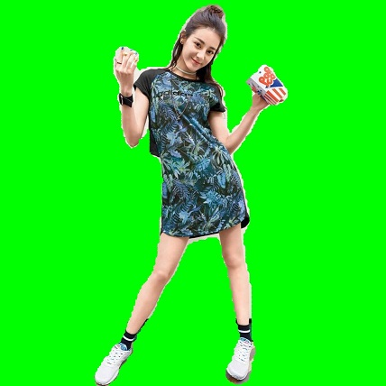
