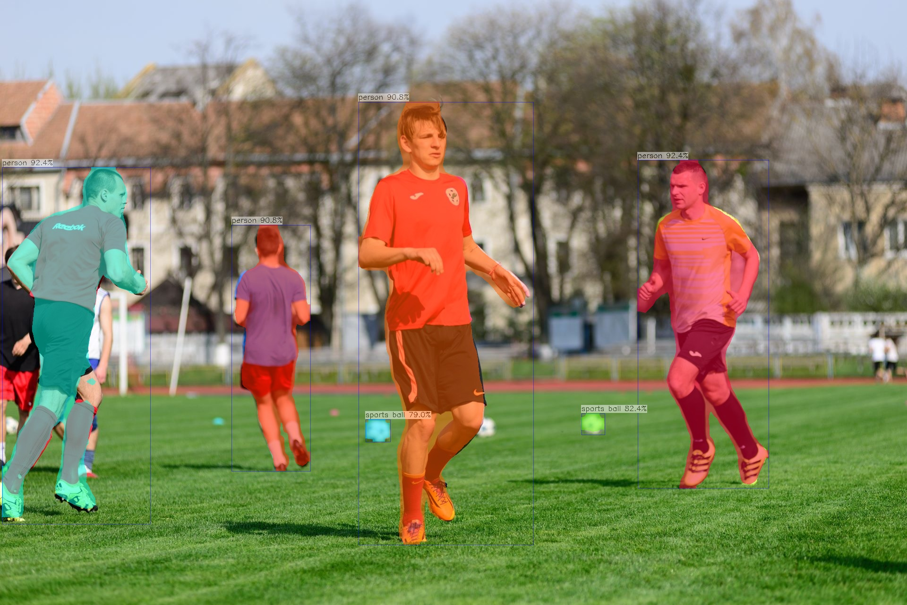
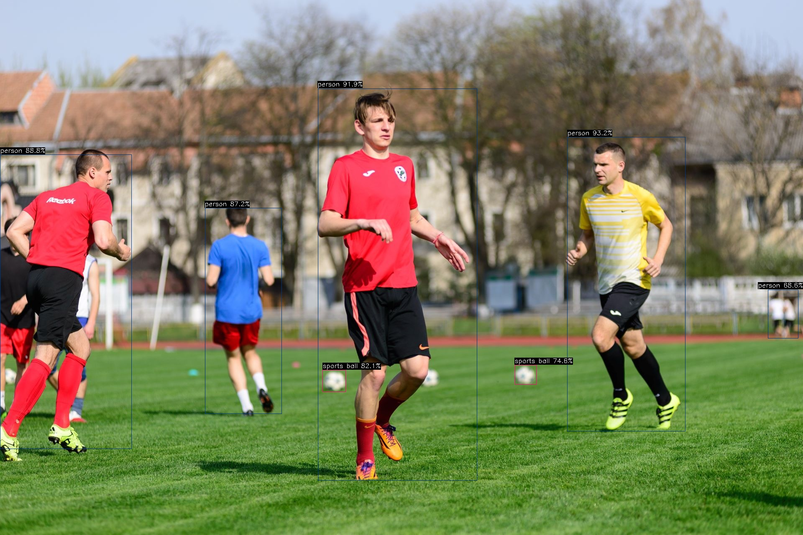
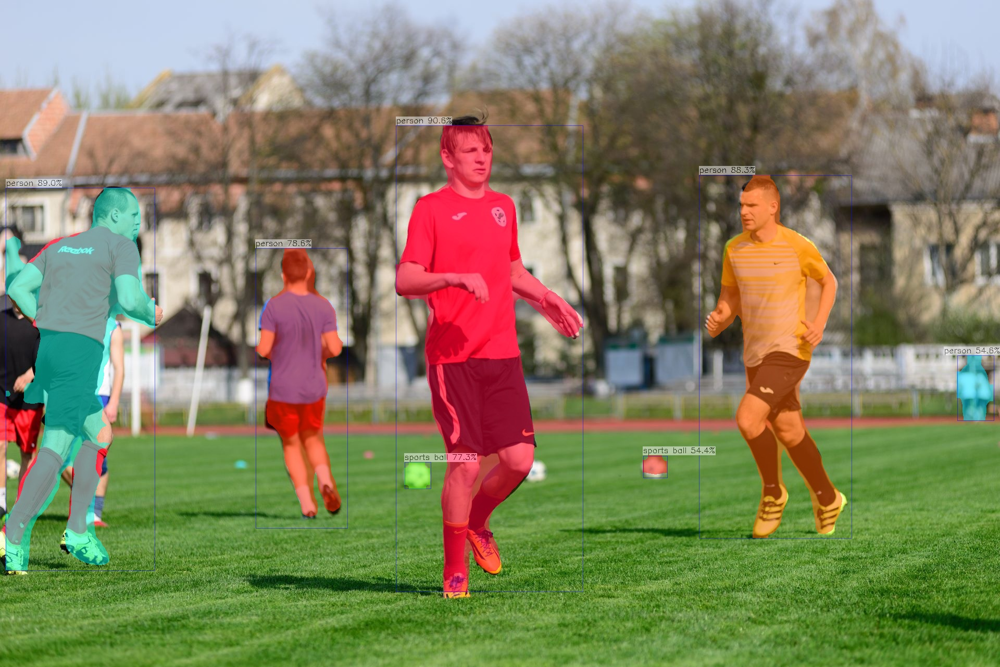
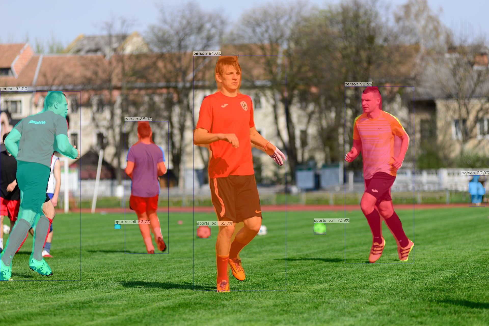
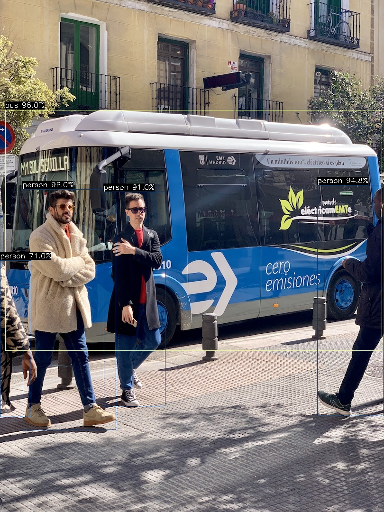
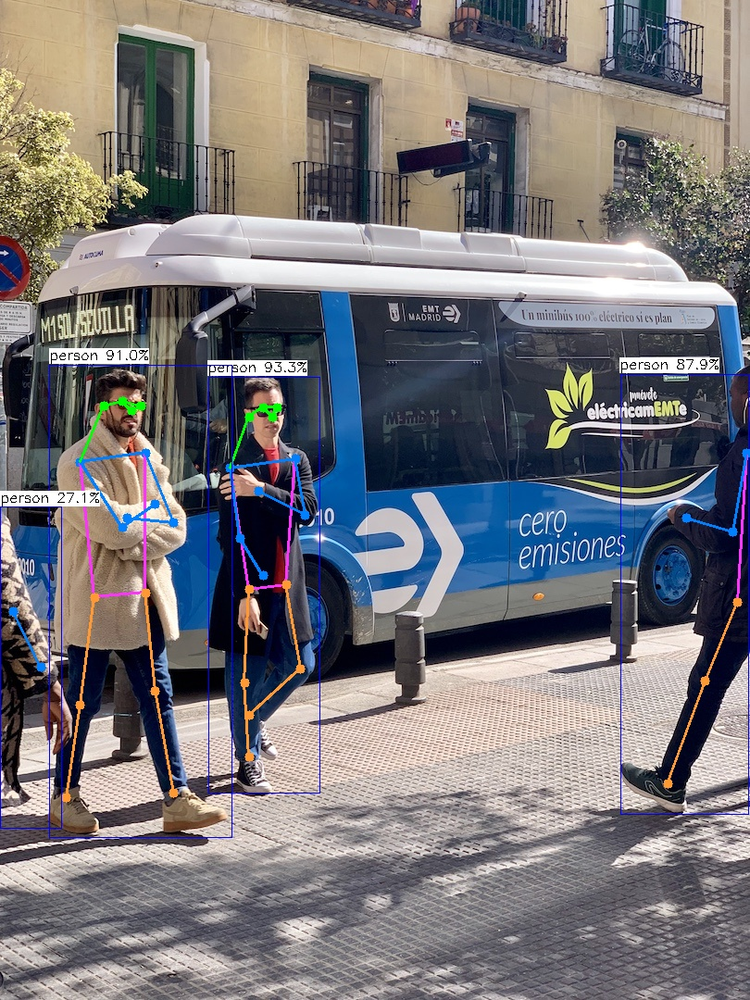
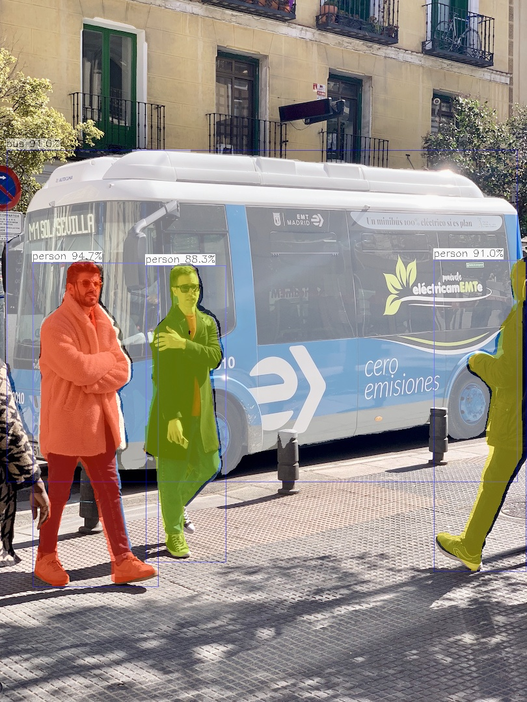

# examples

AX-Samples 将不断更新最流行、实用、有趣的 AX615 示例代码。以下列表覆盖当前 `examples/ax615` 目录中已经提供的大部分应用，后续会随着模型支持一起扩充。

- 物体检测
  - [YOLOv5s](#YOLOv5s)
  - [YOLOv5s_seg](#YOLOv5s_seg)
  - [YOLO11s](#YOLO11s)
  - [YOLOv8](#YOLOv8)
  - [YOLO26](#YOLO26)
- 实例分割
  - [YOLOv8-Seg](#YOLOv8-Seg)
  - [YOLO11-Seg](#YOLO11-Seg)
  - [YOLO26-seg](#YOLO26-seg)
- 人体关键点
  - [YOLOv8-Pose](#YOLOv8-Pose)
  - [YOLO11-Pose](#YOLO11-Pose)
  - [YOLO26-pose](#YOLO26-pose)


### 运行示例

#### YOLO11s
```
/root/data/615/install # ./ax_yolo11 -m ../yolo11s_npu2.axmodel -i ../football.jpg 
--------------------------------------
model file : ../yolo11s_npu2.axmodel
image file : ../football.jpg
img_h, img_w : 640 640
--------------------------------------
Engine creating handle is done.
Engine creating context is done.
Engine get io info is done. 
Engine alloc io is done. 
Engine push input is done. 
--------------------------------------
post process cost time:14.41 ms 
--------------------------------------
Repeat 1 times, avg time 27.46 ms, max_time 27.46 ms, min_time 27.46 ms
--------------------------------------
detection num: 7
 0:  96%, [ 759,  214, 1127, 1152], person
 0:  94%, [   0,  359,  315, 1103], person
 0:  94%, [1350,  344, 1628, 1036], person
 0:  89%, [ 490,  480,  663,  996], person
32:  73%, [ 771,  888,  828,  938], sports ball
32:  67%, [1231,  876, 1280,  924], sports ball
 0:  56%, [   0,  565,   85,  992], person
--------------------------------------
```


#### YOLO11-Seg
```
/root/data/615/install # ./ax_yolo11_seg -m ../yolo11s-seg_npu2.axmodel -i ../football.jpg 
--------------------------------------
model file : ../yolo11s-seg_npu2.axmodel
image file : ../football.jpg
img_h, img_w : 640 640
--------------------------------------
Engine creating handle is done.
Engine creating context is done.
Engine get io info is done. 
Engine alloc io is done. 
Engine push input is done. 
--------------------------------------

input size: 1
    name:   images [UINT8] [BGR] 
        1 x 640 x 640 x 3


output size: 7
    name: /model.23/Concat_1_output_0 [FLOAT32]
        1 x 80 x 80 x 144

    name: /model.23/Concat_2_output_0 [FLOAT32]
        1 x 40 x 40 x 144

    name: /model.23/Concat_3_output_0 [FLOAT32]
        1 x 20 x 20 x 144

    name: /model.23/cv4.0/cv4.0.2/Conv_output_0 [FLOAT32]
        1 x 80 x 80 x 32

    name: /model.23/cv4.1/cv4.1.2/Conv_output_0 [FLOAT32]
        1 x 40 x 40 x 32

    name: /model.23/cv4.2/cv4.2.2/Conv_output_0 [FLOAT32]
        1 x 20 x 20 x 32

    name:  output1 [FLOAT32]
        1 x 32 x 160 x 160

post process cost time:46.51 ms 
--------------------------------------
Repeat 1 times, avg time 35.73 ms, max_time 35.73 ms, min_time 35.73 ms
--------------------------------------
detection num: 6
 0:  92%, [1350,  339, 1628, 1036], person
 0:  92%, [   5,  354,  319, 1111], person
 0:  91%, [ 759,  216, 1129, 1155], person
 0:  91%, [ 490,  477,  658,  999], person
32:  82%, [1231,  876, 1281,  922], sports ball
32:  79%, [ 774,  889,  826,  937], sports ball
--------------------------------------
```


#### YOLO11-Pose
```
/root/data/615/install # ./ax_yolo11_pose -m ../yolo11s-pose_npu2.axmodel -i ../football.jpg 
--------------------------------------
model file : ../yolo11s-pose_npu2.axmodel
image file : ../football.jpg
img_h, img_w : 640 640
--------------------------------------
Engine creating handle is done.
Engine creating context is done.
Engine get io info is done. 
Engine alloc io is done. 
Engine push input is done. 
--------------------------------------
post process cost time:4.85 ms 
--------------------------------------
Repeat 1 times, avg time 27.95 ms, max_time 27.95 ms, min_time 27.95 ms
--------------------------------------
detection num: 4
 0:  94%, [ 757,  220, 1126, 1149], person
 0:  93%, [1352,  346, 1633, 1033], person
 0:  89%, [ 488,  477,  665,  996], person
 0:  81%, [   0,  358,  318, 1110], person
--------------------------------------
```


#### YOLOv5s
```
/root/data/615/install # ./ax_yolov5s -m ../yolov5s_npu2.axmodel -i ../football.jpg 
--------------------------------------
model file : ../yolov5s_npu2.axmodel
image file : ../football.jpg
img_h, img_w : 640 640
--------------------------------------
Engine creating handle is done.
Engine creating context is done.
Engine get io info is done. 
Engine alloc io is done. 
Engine push input is done. 
--------------------------------------
post process cost time:4.71 ms 
--------------------------------------
Repeat 1 times, avg time 18.74 ms, max_time 18.74 ms, min_time 18.74 ms
--------------------------------------
detection num: 7
 0:  93%, [1356,  328, 1639, 1034], person
 0:  92%, [ 760,  212, 1140, 1151], person
 0:  89%, [   0,  370,  315, 1077], person
 0:  87%, [ 490,  498,  674,  993], person
32:  82%, [ 771,  886,  828,  939], sports ball
32:  75%, [1231,  874, 1283,  922], sports ball
 0:  69%, [1836,  694, 1908,  811], person
--------------------------------------
```


#### YOLOv5s_seg
```
/root/data/615/install # ./ax_yolov5s_seg -m ../yolov5-seg_npu2.axmodel -i ../football.jpg 
--------------------------------------
model file : ../yolov5-seg_npu2.axmodel
image file : ../football.jpg
img_h, img_w : 640 640
--------------------------------------
Engine creating handle is done.
Engine creating context is done.
Engine get io info is done. 
Engine alloc io is done. 
Engine push input is done. 
--------------------------------------
post process cost time:42.10 ms 
--------------------------------------
Repeat 1 times, avg time 27.21 ms, max_time 27.21 ms, min_time 27.21 ms
--------------------------------------
detection num: 7
 0:  91%, [ 760,  241, 1120, 1139], person
 0:  89%, [  11,  361,  299, 1097], person
 0:  88%, [1342,  337, 1636, 1035], person
 0:  79%, [ 491,  477,  668, 1017], person
32:  77%, [ 777,  888,  828,  940], sports ball
 0:  55%, [1838,  683, 1908,  809], person
32:  54%, [1235,  876, 1282,  919], sports ball
--------------------------------------
```


#### YOLOv8_pose
```
/root/data/615/install # ./ax_yolov8_pose -m ../yolov8s-pose_npu2.axmodel -i ../football.jpg 
--------------------------------------
model file : ../yolov8s-pose_npu2.axmodel
image file : ../football.jpg
img_h, img_w : 640 640
--------------------------------------
Engine creating handle is done.
Engine creating context is done.
Engine get io info is done. 
Engine alloc io is done. 
Engine push input is done. 
--------------------------------------
post process cost time:4.83 ms 
--------------------------------------
Repeat 1 times, avg time 28.21 ms, max_time 28.21 ms, min_time 28.21 ms
--------------------------------------
detection num: 4
 0:  93%, [1349,  337, 1633, 1039], person
 0:  93%, [ 760,  212, 1125, 1155], person
 0:  90%, [   0,  354,  344, 1104], person
 0:  88%, [ 485,  471,  660,  999], person
--------------------------------------
```


#### YOLOv8_seg
```
/root/data/615/install # ./ax_yolov8_seg -m ../yolov8s-seg_npu2.axmodel -i ../football.jpg 
--------------------------------------
model file : ../yolov8s-seg_npu2.axmodel
image file : ../football.jpg
img_h, img_w : 640 640
--------------------------------------
Engine creating handle is done.
Engine creating context is done.
Engine get io info is done. 
Engine alloc io is done. 
Engine push input is done. 
--------------------------------------

input size: 1
    name:   images [UINT8] [BGR] 
        1 x 640 x 640 x 3


output size: 7
    name: /model.22/Concat_1_output_0 [FLOAT32]
        1 x 80 x 80 x 144

    name: /model.22/Concat_2_output_0 [FLOAT32]
        1 x 40 x 40 x 144

    name: /model.22/Concat_3_output_0 [FLOAT32]
        1 x 20 x 20 x 144

    name: /model.22/cv4.0/cv4.0.2/Conv_output_0 [FLOAT32]
        1 x 80 x 80 x 32

    name: /model.22/cv4.1/cv4.1.2/Conv_output_0 [FLOAT32]
        1 x 40 x 40 x 32

    name: /model.22/cv4.2/cv4.2.2/Conv_output_0 [FLOAT32]
        1 x 20 x 20 x 32

    name:  output1 [FLOAT32]
        1 x 32 x 160 x 160

post process cost time:44.96 ms 
--------------------------------------
Repeat 1 times, avg time 35.58 ms, max_time 35.58 ms, min_time 35.58 ms
--------------------------------------
detection num: 8
 0:  92%, [1354,  340, 1624, 1035], person
 0:  92%, [   0,  359,  317, 1104], person
 0:  91%, [ 759,  219, 1124, 1144], person
 0:  88%, [ 490,  476,  661,  998], person
32:  74%, [1232,  876, 1280,  922], sports ball
32:  63%, [ 450,  882,  475,  900], sports ball
32:  63%, [ 773,  888,  828,  937], sports ball
 0:  50%, [1840,  690, 1905,  811], person
--------------------------------------
```


### YOLO26
```
/root/data/615/install # ./ax_yolo26 -m ../../yolo26/yolo26s_npu2.axmodel -i ../bus.jpg 
--------------------------------------
model file : ../../yolo26/yolo26s_npu2.axmodel
image file : ../bus.jpg
img_h, img_w : 640 640
--------------------------------------
Engine creating handle is done.
Engine creating context is done.
Engine get io info is done. 
Engine alloc io is done. 
Engine push input is done. 
--------------------------------------
post process cost time:8.89 ms 
--------------------------------------
Repeat 1 times, avg time 27.01 ms, max_time 27.01 ms, min_time 27.01 ms
--------------------------------------
detection num: 5
 0:  96%, [  48,  399,  245,  907], person
 5:  96%, [  11,  232,  806,  740], bus
 0:  95%, [ 669,  390,  809,  879], person
 0:  91%, [ 219,  404,  349,  857], person
 0:  71%, [   0,  549,   66,  880], person
--------------------------------------
```


### YOLO26-pose
```
/root/data/615/install # ./ax_yolo26_pose -m ../../yolo26pose/yolo26s-pose_npu2.axmodel -i ../bus.jpg 
--------------------------------------
model file : ../../yolo26pose/yolo26s-pose_npu2.axmodel
image file : ../bus.jpg
img_h, img_w : 640 640
--------------------------------------
Engine creating handle is done.
Engine creating context is done.
Engine get io info is done.
Engine alloc io is done.
Engine push input is done.
--------------------------------------
post process cost time:0.51 ms 
--------------------------------------
Repeat 1 times, avg time 28.58 ms, max_time 28.58 ms, min_time 28.58 ms
--------------------------------------
detection num: 4
 0:  93%, [ 225,  407,  346,  857], person
 0:  91%, [  53,  394,  251,  905], person
 0:  88%, [ 670,  404,  809,  879], person
 0:  27%, [   0,  547,   67,  895], person
--------------------------------------
```


### YOLO26-seg
```
/root/data/615/install # ./ax_yolo26_seg -m ../../yolo26seg/yolo26s-seg_npu2.axmodel -i ../bus.jpg 
--------------------------------------
model file : ../../yolo26seg/yolo26s-seg_npu2.axmodel
image file : ../bus.jpg
img_h, img_w : 640 640
--------------------------------------
Engine creating handle is done.
Engine creating context is done.
Engine get io info is done.
Engine alloc io is done.
Engine push input is done.
--------------------------------------
post process cost time:47.50 ms 
--------------------------------------
Repeat 1 times, avg time 37.34 ms, max_time 37.34 ms, min_time 37.34 ms
--------------------------------------
detection num: 4
 0:  95%, [  50,  404,  243,  903], person
 0:  91%, [ 667,  400,  809,  880], person
 5:  91%, [  10,  231,  796,  742], bus
 0:  88%, [ 224,  408,  347,  865], person
--------------------------------------
```
