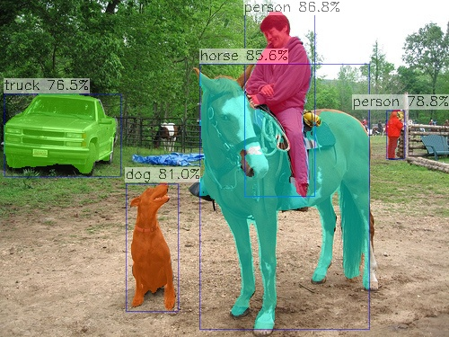
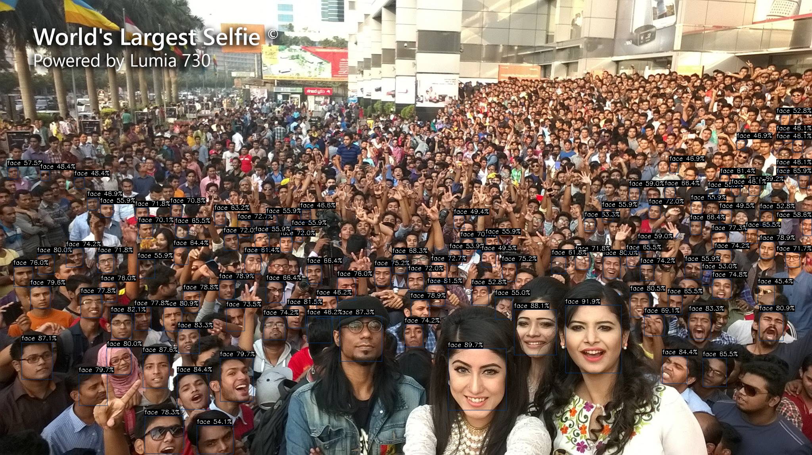
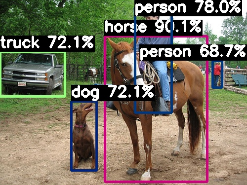
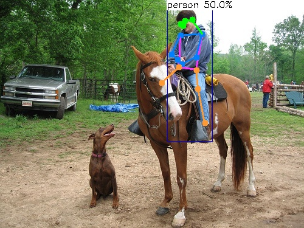
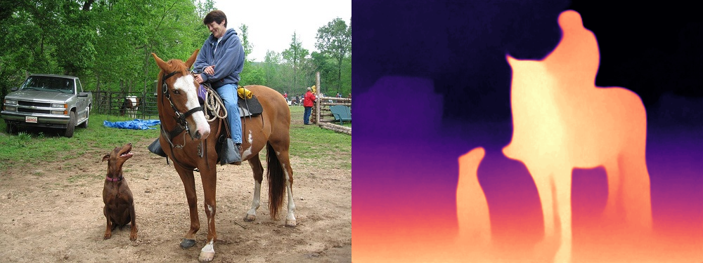
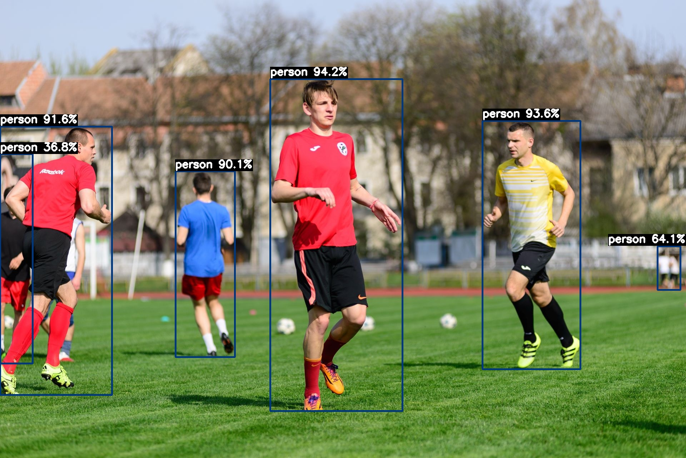

# examples

AX-Samples 将不断更新最流行的、实用的、有趣的示例代码。

- 物体检测
  - [YOLOv5](#YOLOv5)
  - [YOLOv8](#YOLOv8)
  - [YOLO-World](#YOLO-World)
- 实例分割
  - [YOLOv5-seg](#YOLOv5-Seg)
- 人脸检测
  - [YOLOv7-Face](#YOLOv7-Face)
- 人体关键点
  - [YOLOv8-Pose](#YOLOv8-Pose)
- 深度估计
  - [Depth-Anything](#Depth-Anything) 

### 运行示例

#### YOLOv5
```
root@AXERA:/home/test# ./ax_yolov5s -m yolov5s.axmodel -i ssd_horse.jpg
--------------------------------------
model file : yolov5s.axmodel
image file : ssd_horse.jpg
img_h, img_w : 640 640
--------------------------------------
Engine creating handle is done.
Engine creating context is done.
Engine get io info is done.
Engine alloc io is done.
Engine push input is done.
--------------------------------------
post process cost time:4.25 ms
--------------------------------------
Repeat 1 times, avg time 17.07 ms, max_time 17.07 ms, min_time 17.07 ms
--------------------------------------
detection num: 6
 0:  83%, [ 273,   17,  350,  227], person
17:  83%, [ 219,   62,  422,  361], horse
16:  82%, [ 142,  201,  197,  350], dog
 7:  74%, [   0,  107,  132,  195], truck
 0:  74%, [ 429,  125,  450,  180], person
 0:  47%, [ 403,  130,  413,  148], person
--------------------------------------
```


#### YOLOv5-Seg
```
root@AXERA:/home/test# ./ax_yolov5s_seg -m yolov5s-seg.axmodel -i ssd_horse.jpg
--------------------------------------
model file : yolov5s-seg.axmodel
image file : ssd_horse.jpg
img_h, img_w : 640 640
--------------------------------------
Engine creating handle is done.
Engine creating context is done.
Engine get io info is done.
Engine alloc io is done.
Engine push input is done.
--------------------------------------
post process cost time:23.53 ms
--------------------------------------
Repeat 1 times, avg time 24.22 ms, max_time 24.22 ms, min_time 24.22 ms
--------------------------------------
detection num: 5
 0:  87%, [ 272,   13,  351,  220], person
17:  86%, [ 222,   71,  412,  367], horse
16:  81%, [ 140,  204,  199,  346], dog
 0:  79%, [ 430,  123,  451,  177], person
 7:  76%, [   5,  104,  135,  197], truck
--------------------------------------
```


#### YOLOv7-Face
```
root@AXERA:/home/test# ./ax_yolov7_tiny_face -m yolov7-tiny-face.axmodel -i selfie.jpg
--------------------------------------
model file : yolov7-tiny-face.axmodel
image file : selfie.jpg
img_h, img_w : 640 640
--------------------------------------
[Axera version]: libax_sys.so V1.13.0 Apr 26 2023 16:24:35
Engine creating handle is done.
Engine creating context is done.
Engine get io info is done.
Engine alloc io is done.
Engine push input is done.
--------------------------------------
post process cost time:4.35 ms
--------------------------------------
Repeat 1 times, avg time 8.95 ms, max_time 8.95 ms, min_time 8.95 ms
--------------------------------------
detection num: 103
```



#### YOLOv8
```
root@AXERA:/home/test# ./ax_yolov8s -m yolov8n.axmodel -i ssd_horse.jpg
--------------------------------------
model file : yolov8n.axmodel
image file : ssd_horse.jpg
img_h, img_w : 640 640
--------------------------------------
Engine creating handle is done.
Engine creating context is done.
Engine get io info is done.
Engine alloc io is done.
Engine push input is done.
--------------------------------------
post process cost time:5.95 ms
--------------------------------------
Repeat 1 times, avg time 11.58 ms, max_time 11.58 ms, min_time 11.58 ms
--------------------------------------
detection num: 5
17:  90%, [ 212,   73,  419,  369], horse
 0:  78%, [ 273,   14,  348,  230], person
16:  72%, [ 144,  205,  196,  347], dog
 7:  72%, [   0,  105,  132,  197], truck
 0:  69%, [ 430,  123,  451,  178], person
--------------------------------------
```


### YOLOV8-POSE
```
/opt/test # ./ax_yolov8_pose -m yolov8s-pose.axmodel -i ssd_horse.jpg
--------------------------------------
model file : yolov8s-pose.axmodel
image file : ssd_horse.jpg
img_h, img_w : 640 640
--------------------------------------
Engine creating handle is done.
Engine creating context is done.
Engine get io info is done.
Engine alloc io is done.
Engine push input is done.
--------------------------------------
post process cost time:1.65 ms
--------------------------------------
Repeat 1 times, avg time 23.59 ms, max_time 23.59 ms, min_time 23.59 ms
--------------------------------------
detection num: 1
 0:  50%, [ 275,   13,  350,  233], person
--------------------------------------
```


### Depth-Anything
```
/opt/test # ./ax_depth_anything -m depth_anything.axmodel -i /opt/data/npu/images/dog.jpg
--------------------------------------
model file : depth_anything.axmodel
image file : /opt/data/npu/images/dog.jpg
img_h, img_w : 256 384
--------------------------------------
Engine creating handle is done.
Engine creating context is done.
Engine get io info is done.
Engine alloc io is done.
Engine push input is done.
--------------------------------------
post process cost time:15.36 ms
--------------------------------------
Repeat 1 times, avg time 62.11 ms, max_time 62.11 ms, min_time 62.11 ms
--------------------------------------
```


### YOLO-World
```
/opt/test # ./ax_yolo_world -m yolo_world_s.axmodel -i test.jpg
--------------------------------------
model file : yolo_world_s.axmodel
image file : test.jpg
img_h, img_w : 640 640
--------------------------------------
Engine creating handle is done.
Engine creating context is done.
Engine get io info is done.
Engine alloc io is done.
Engine push input is done.
--------------------------------------
post process cost time:3.75 ms
--------------------------------------
Repeat 1 times, avg time 25.26 ms, max_time 25.26 ms, min_time 25.26 ms
--------------------------------------
detection num: 6
 0:  94%, [ 756,  221, 1128, 1151], person
 0:  94%, [1350,  338, 1625, 1033], person
 0:  92%, [   0,  354,  314, 1106], person
 0:  90%, [ 491,  479,  658, 1001], person
 0:  64%, [1840,  689, 1905,  812], person
 0:  37%, [   0,  431,   92, 1019], person
--------------------------------------
```


