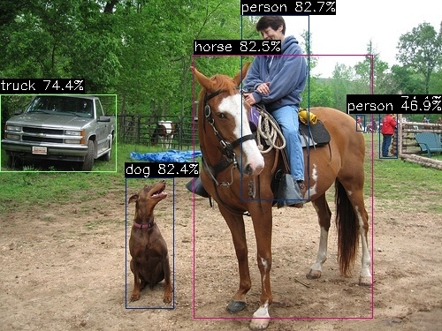
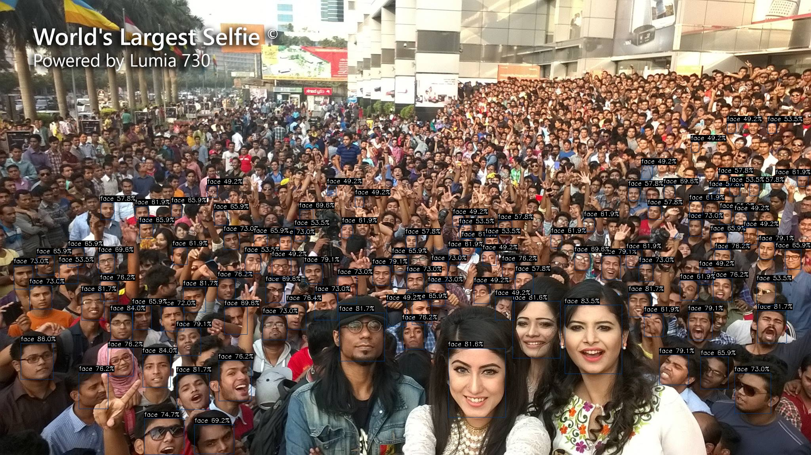
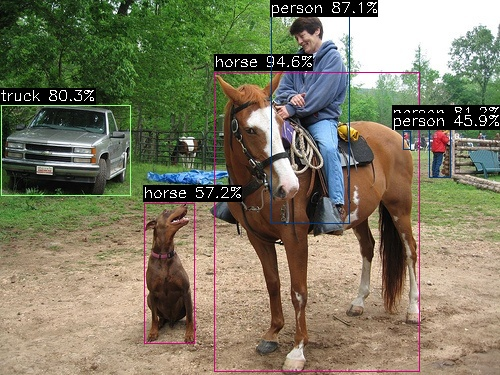
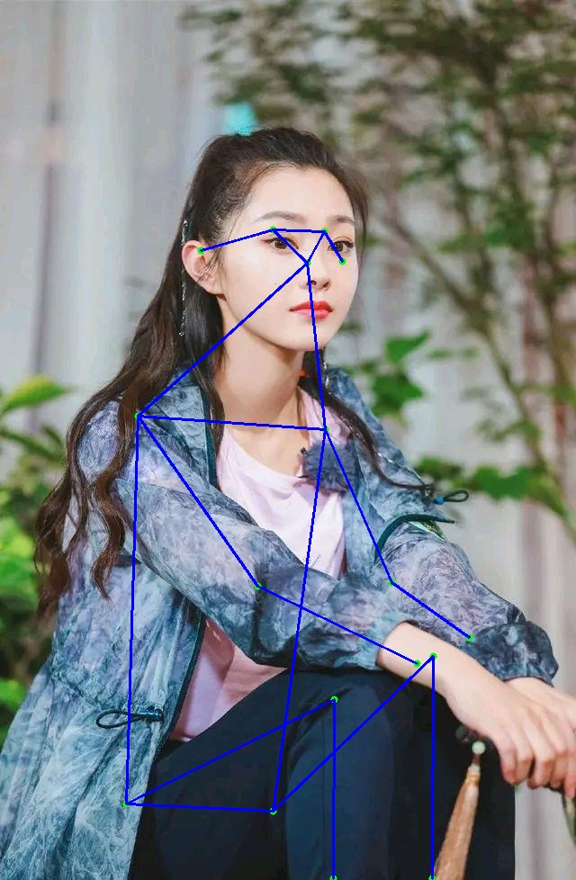

# examples

AX-Samples 将不断更新最流行的、实用的、有趣的示例代码。

- 物体检测
  - [YOLOv5](#YOLOv5)
  - [YOLOv6](#YOLOv6)
  - [YOLOv7-Tiny](#YOLOv7-Tiny)
  - [YOLOv8](#YOLOv8)
  - [YOLOX](#YOLOX)
- 实例分割
  - [YOLOv5-seg](#YOLOv5-Seg)
- 人脸检测
  - [YOLOv5-Face](#YOLOv5-Face)
  - [YOLOv7-Face](#YOLOv7-Face)
- 人体关键点
  - [RTMPose](#RTMPose)
  - [YOLOv8-Pose](#YOLOv8-Pose)


### 运行示例

#### YOLOv5
```
root@AXERA:/home/test# ./ax_yolov5s -m yolov5s.axmodel -i ssd_horse.jpg
--------------------------------------
model file : yolov5s.axmodel
image file : ssd_horse.jpg
img_h, img_w : 640 640
--------------------------------------
Engine creating handle is done.
Engine creating context is done.
Engine get io info is done.
Engine alloc io is done.
Engine push input is done.
--------------------------------------
post process cost time:4.25 ms
--------------------------------------
Repeat 1 times, avg time 17.07 ms, max_time 17.07 ms, min_time 17.07 ms
--------------------------------------
detection num: 6
 0:  83%, [ 273,   17,  350,  227], person
17:  83%, [ 219,   62,  422,  361], horse
16:  82%, [ 142,  201,  197,  350], dog
 7:  74%, [   0,  107,  132,  195], truck
 0:  74%, [ 429,  125,  450,  180], person
 0:  47%, [ 403,  130,  413,  148], person
--------------------------------------
```


#### YOLOv7-Tiny
```
root@AXERA:/home/test# ./ax_yolov7 -m yolov7-tiny.axmodel -i ssd_horse.jpg
--------------------------------------
model file : yolov7-tiny.axmodel
image file : ssd_horse.jpg
img_h, img_w : 640 640
--------------------------------------
Engine creating handle is done.
Engine creating context is done.
Engine get io info is done.
Engine alloc io is done.
Engine push input is done.
--------------------------------------
post process cost time:4.14 ms
--------------------------------------
Repeat 1 times, avg time 20.02 ms, max_time 20.02 ms, min_time 20.02 ms
--------------------------------------
detection num: 5
17:  90%, [ 218,   62,  417,  374], horse
 0:  84%, [ 269,   13,  353,  224], person
 0:  82%, [ 431,  121,  448,  180], person
 7:  81%, [   2,  106,  133,  197], truck
16:  76%, [ 143,  201,  196,  349], dog
--------------------------------------
```


#### YOLOX
```
/tmp/samples # ./ax_yoloxs -m yolox.axmodel -i ssd_horse.jpg
--------------------------------------
model file : yolox.axmodel
image file : ssd_horse.jpg
img_h, img_w : 640 640
--------------------------------------
Engine creating handle is done.
Engine creating context is done.
Engine get io info is done.
Engine alloc io is done.
Engine push input is done.
--------------------------------------
post process cost time:1.51 ms
--------------------------------------
Repeat 1 times, avg time 24.70 ms, max_time 24.70 ms, min_time 24.70 ms
--------------------------------------
detection num: 6
17:  94%, [ 220,   71,  421,  370], horse
16:  90%, [ 144,  204,  196,  347], dog
 0:  88%, [ 273,   15,  349,  228], person
 2:  83%, [   1,  104,  134,  198], car
 0:  83%, [ 430,  124,  451,  178], person
 0:  46%, [ 402,  131,  410,  149], person
--------------------------------------
```


#### YOLOv5-Face
```
root@AXERA:/home/test# ./ax_yolov5_face -m yolov5s-face.axmodel -i selfie.jpg
--------------------------------------
model file : yolov5s-face.axmodel
image file : selfie.jpg
img_h, img_w : 640 640
--------------------------------------
Engine creating handle is done.
Engine creating context is done.
Engine get io info is done.
Engine alloc io is done.
Engine push input is done.
--------------------------------------
post process cost time:6.37 ms
--------------------------------------
Repeat 1 times, avg time 18.35 ms, max_time 18.35 ms, min_time 18.35 ms
--------------------------------------
detection num: 108
```



#### YOLOv5-Seg
```
root@AXERA:/home/test# ./ax_yolov5s_seg -m yolov5s-seg.axmodel -i ssd_horse.jpg
--------------------------------------
model file : yolov5s-seg.axmodel
image file : ssd_horse.jpg
img_h, img_w : 640 640
--------------------------------------
Engine creating handle is done.
Engine creating context is done.
Engine get io info is done.
Engine alloc io is done.
Engine push input is done.
--------------------------------------
post process cost time:23.53 ms
--------------------------------------
Repeat 1 times, avg time 24.22 ms, max_time 24.22 ms, min_time 24.22 ms
--------------------------------------
detection num: 5
 0:  87%, [ 272,   13,  351,  220], person
17:  86%, [ 222,   71,  412,  367], horse
16:  81%, [ 140,  204,  199,  346], dog
 0:  79%, [ 430,  123,  451,  177], person
 7:  76%, [   5,  104,  135,  197], truck
--------------------------------------
```


#### YOLOv7-Face
```
root@AXERA:/home/test# ./ax_yolov7_tiny_face -m yolov7-tiny-face.axmodel -i selfie.jpg
--------------------------------------
model file : yolov7-tiny-face.axmodel
image file : selfie.jpg
img_h, img_w : 640 640
--------------------------------------
[Axera version]: libax_sys.so V1.13.0 Apr 26 2023 16:24:35
Engine creating handle is done.
Engine creating context is done.
Engine get io info is done.
Engine alloc io is done.
Engine push input is done.
--------------------------------------
post process cost time:4.35 ms
--------------------------------------
Repeat 1 times, avg time 8.95 ms, max_time 8.95 ms, min_time 8.95 ms
--------------------------------------
detection num: 103
```


#### YOLOv6
```
root@AXERA:/home/test# ./ax_yolov6 -m yolov6s.axmodel -i ssd_horse.jpg
--------------------------------------
model file : yolov6s.axmodel
image file : ssd_horse.jpg
img_h, img_w : 640 640
--------------------------------------
Engine creating handle is done.
Engine creating context is done.
Engine get io info is done.
Engine alloc io is done.
Engine push input is done.
--------------------------------------
post process cost time:4.24 ms
--------------------------------------
Repeat 1 times, avg time 6.94 ms, max_time 6.94 ms, min_time 6.94 ms
--------------------------------------
detection num: 6
17:  95%, [ 214,   72,  421,  372], horse
 0:  87%, [ 271,   13,  350,  224], person
 0:  81%, [ 429,  123,  452,  178], person
 7:  80%, [   1,  105,  131,  196], truck
17:  57%, [ 144,  203,  194,  344], horse
 0:  46%, [ 403,  131,  411,  149], person
--------------------------------------
```


#### YOLOv8
```
root@AXERA:/home/test# ./ax_yolov8s -m yolov8n.axmodel -i ssd_horse.jpg
--------------------------------------
model file : yolov8n.axmodel
image file : ssd_horse.jpg
img_h, img_w : 640 640
--------------------------------------
Engine creating handle is done.
Engine creating context is done.
Engine get io info is done.
Engine alloc io is done.
Engine push input is done.
--------------------------------------
post process cost time:5.95 ms
--------------------------------------
Repeat 1 times, avg time 11.58 ms, max_time 11.58 ms, min_time 11.58 ms
--------------------------------------
detection num: 5
17:  90%, [ 212,   73,  419,  369], horse
 0:  78%, [ 273,   14,  348,  230], person
16:  72%, [ 144,  205,  196,  347], dog
 7:  72%, [   0,  105,  132,  197], truck
 0:  69%, [ 430,  123,  451,  178], person
--------------------------------------
```


### YOLOV8-POSE
```
/opt/test # ./ax_yolov8_pose -m yolov8s-pose.axmodel -i ssd_horse.jpg
--------------------------------------
model file : yolov8s-pose.axmodel
image file : ssd_horse.jpg
img_h, img_w : 640 640
--------------------------------------
Engine creating handle is done.
Engine creating context is done.
Engine get io info is done.
Engine alloc io is done.
Engine push input is done.
--------------------------------------
post process cost time:1.65 ms
--------------------------------------
Repeat 1 times, avg time 23.59 ms, max_time 23.59 ms, min_time 23.59 ms
--------------------------------------
detection num: 1
 0:  50%, [ 275,   13,  350,  233], person
--------------------------------------
```


### RTMPose
```
/opt/test # ./ax_simcc_pose -m rtmpose.axmodel -i songyi.jpeg
--------------------------------------
model file : rtmpose.axmodel
image file : songyi.jpeg
img_h, img_w : 256 192
--------------------------------------
Engine creating handle is done.
Engine creating context is done.
Engine get io info is done.
Engine alloc io is done.
Engine push input is done.
--------------------------------------
post process cost time:0.10 ms
--------------------------------------
Repeat 1 times, avg time 4.29 ms, max_time 4.29 ms, min_time 4.29 ms
--------------------------------------
```

