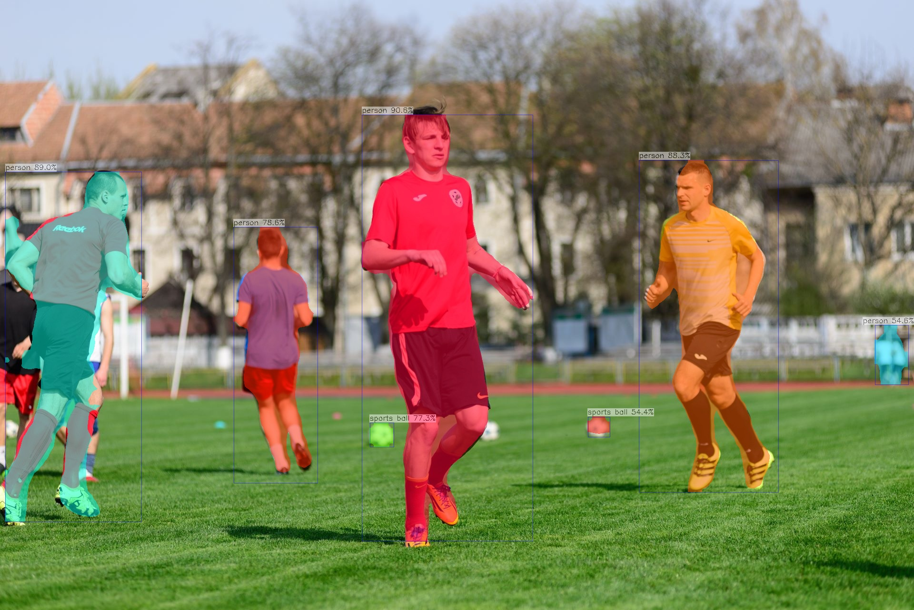

# examples

AX-Samples 将不断更新最流行、实用、有趣的 AX637 示例代码。以下列表覆盖当前 `examples/ax637` 目录中已经提供的应用，后续会随着模型支持一起扩充。

- 物体检测
  - [YOLOv5s](#YOLOv5s)
  - [YOLOv8s](#YOLOv8s)
  - [YOLO11s](#YOLO11s)
- 实例分割
  - [YOLOv5-Seg](#YOLOv5-Seg)
  - [YOLOv8-Seg](#YOLOv8-Seg)
  - [YOLO11-Seg](#YOLO11-Seg)
- 人脸检测
  - [YOLOv5-Face](#YOLOv5-Face)
- 人体关键点
  - [YOLOv8-Pose](#YOLOv8-Pose)
  - [YOLO11-Pose](#YOLO11-Pose)
- 分类
  - [AX-Classification](#AX-Classification)
  - [YOLO11n-Classification](#YOLO11n-Classification)

> 提示：所有示例均默认在 `root@AXERA-AX637:/home/test` 目录执行，模型(`.axmodel`) 与测试图片需提前拷贝到设备上；示例中的图片仅为占位，稍后可放置到 `docs/ax637` 目录。

### 运行示例

#### YOLO11s
```
root@AXERA-AX637:/home/test# ./ax_yolo11 -m yolo11s.axmodel -i ssd_horse.jpg -r 10
--------------------------------------
model file : yolo11s.axmodel
image file : ssd_horse.jpg
img_h, img_w : 640 640
--------------------------------------
Engine creating handle is done.
Engine creating context is done.
Engine get io info is done.
Engine alloc io is done.
Engine push input is done.
--------------------------------------
post process cost time:4.04 ms
--------------------------------------
Repeat 10 times, avg time 3.20 ms, max_time 3.21 ms, min_time 3.19 ms
--------------------------------------
detection num: 6
17:  96%, [ 216,   74,  421,  373], horse
 0:  91%, [ 274,   14,  349,  231], person
16:  86%, [ 144,  204,  196,  347], dog
 0:  81%, [ 431,  124,  450,  178], person
13:  77%, [ 469,  149,  499,  179], bench
 7:  60%, [   1,  106,  132,  197], truck
--------------------------------------
```


#### YOLO11-Seg
```
root@AXERA-AX637:/home/test# ./ax_yolo11_seg -m yolo11s_seg.axmodel -i ssd_car.jpg
--------------------------------------
model file : yolo11s_seg.axmodel
image file : ssd_car.jpg
img_h, img_w : 640 640
--------------------------------------
Engine creating handle is done.
Engine creating context is done.
Engine get io info is done.
Engine alloc io is done.
Engine push input is done.
--------------------------------------
post process cost time:8.68 ms
--------------------------------------
Repeat 1 times, avg time 4.69 ms, max_time 4.69 ms, min_time 4.69 ms
--------------------------------------
detection num: 3
 2:  96%, [ 330,  202,  499,  326], car
 0:  91%, [ 205,  185,  286,  373], person
 5:  89%, [ 128,   67,  450,  299], bus
--------------------------------------
```


#### YOLO11-Pose
```
root@AXERA-AX637:/home/test# ./ax_yolo11_pose -m yolo11s_pose.axmodel -i pose_test.jpg
--------------------------------------
model file : yolo11s_pose.axmodel
image file : pose_test.jpg
img_h, img_w : 640 640
--------------------------------------
Engine creating handle is done.
Engine creating context is done.
Engine get io info is done.
Engine alloc io is done.
Engine push input is done.
--------------------------------------
post process cost time:1.31 ms
--------------------------------------
Repeat 1 times, avg time 3.35 ms, max_time 3.35 ms, min_time 3.35 ms
--------------------------------------
detection num: 4
 0:  94%, [ 761,  220, 1128, 1153], person
 0:  91%, [1352,  343, 1633, 1033], person
 0:  89%, [ 488,  477,  661,  996], person
 0:  81%, [   0,  357,  317, 1110], person
--------------------------------------
```


#### YOLOv8s
```
root@AXERA-AX637:/home/test# ./ax_yolov8s -m yolov8s.axmodel -i test.jpg
--------------------------------------
model file : yolov8s.axmodel
image file : test.jpg
img_h, img_w : 640 640
--------------------------------------
Engine creating handle is done.
Engine creating context is done.
Engine get io info is done.
Engine alloc io is done.
Engine push input is done.
--------------------------------------
post process cost time:3.14 ms
--------------------------------------
Repeat 1 times, avg time 12.89 ms, max_time 12.89 ms, min_time 12.89 ms
--------------------------------------
detection num: 11
 0:  92%, [ 172,  311,  367,  812], person
 0:  87%, [ 496,  287,  671,  798], person
 5:  84%, [ 863,  146, 1232,  492], bus
 0:  84%, [  89,  290,  191,  491], person
14:  79%, [ 744,  610,  803,  649], bird
 0:  79%, [ 610,  275,  679,  464], person
 0:  79%, [ 442,  297,  495,  441], person
 0:  63%, [ 838,  310,  878,  434], person
14:  63%, [ 335,  561,  462,  826], bird
 7:  50%, [ 813,  275,  870,  333], truck
26:  50%, [  90,  325,  120,  419], handbag
--------------------------------------
```


#### YOLOv8-Seg
```
root@AXERA-AX637:/home/test# ./ax_yolov8_seg -m yolov8s_seg.axmodel -i ssd_car.jpg
--------------------------------------
model file : yolov8s_seg.axmodel
image file : ssd_car.jpg
img_h, img_w : 640 640
--------------------------------------
Engine creating handle is done.
Engine creating context is done.
Engine get io info is done.
Engine alloc io is done.
Engine push input is done.
--------------------------------------
post process cost time:8.68 ms
--------------------------------------
Repeat 1 times, avg time 4.69 ms, max_time 4.69 ms, min_time 4.69 ms
--------------------------------------
detection num: 3
 2:  96%, [ 330,  202,  499,  326], car
 0:  91%, [ 205,  185,  286,  373], person
 5:  89%, [ 128,   67,  450,  299], bus
--------------------------------------
```


#### YOLOv8-Pose
```
root@AXERA-AX637:/home/test# ./ax_yolov8_pose -m yolov8s_pose.axmodel -i pose_test.jpg
--------------------------------------
model file : yolov8s_pose.axmodel
image file : pose_test.jpg
img_h, img_w : 640 640
--------------------------------------
Engine creating handle is done.
Engine creating context is done.
Engine get io info is done.
Engine alloc io is done.
Engine push input is done.
--------------------------------------
post process cost time:1.26 ms
--------------------------------------
Repeat 1 times, avg time 3.74 ms, max_time 3.74 ms, min_time 3.74 ms
--------------------------------------
detection num: 4
 0:  93%, [ 756,  212, 1127, 1158], person
 0:  91%, [   0,  358,  316, 1105], person
 0:  91%, [1349,  338, 1629, 1034], person
 0:  87%, [ 489,  474,  656,  996], person
--------------------------------------
```


#### YOLOv5s
```
root@AXERA-AX637:/home/test# ./ax_yolov5s -m yolov5s.axmodel -i test.jpg
--------------------------------------
model file : yolov5s.axmodel
image file : test.jpg
img_h, img_w : 640 640
--------------------------------------
Engine creating handle is done.
Engine creating context is done.
Engine get io info is done.
Engine alloc io is done.
Engine push input is done.
--------------------------------------
post process cost time:2.03 ms
--------------------------------------
Repeat 1 times, avg time 2.89 ms, max_time 2.89 ms, min_time 2.89 ms
--------------------------------------
detection num: 11
 0:  92%, [ 173,  309,  367,  815], person
 0:  84%, [ 495,  302,  677,  785], person
14:  82%, [ 745,  611,  802,  648], bird
 0:  82%, [  91,  284,  191,  499], person
 0:  79%, [ 612,  275,  695,  470], person
16:  79%, [ 316,  562,  469,  821], dog
 5:  77%, [ 863,  148, 1196,  493], bus
 0:  72%, [ 444,  292,  493,  443], person
 2:  63%, [1200,  293, 1279,  401], car
 2:  61%, [ 810,  271,  869,  332], car
 0:  53%, [ 742,  304,  768,  386], person
--------------------------------------
```


#### YOLOv5-Seg
```
root@AXERA-AX637:/home/test# ./ax_yolov5s_seg -m yolov5s-seg.axmodel -i ssd_horse.jpg
--------------------------------------
model file : yolov5s-seg.axmodel
image file : ssd_horse.jpg
img_h, img_w : 640 640
--------------------------------------
Engine creating handle is done.
Engine creating context is done.
Engine get io info is done.
Engine alloc io is done.
Engine push input is done.
--------------------------------------
post process cost time:8.62 ms
--------------------------------------
Repeat 1 times, avg time 11.01 ms, max_time 11.01 ms, min_time 11.01 ms
--------------------------------------
detection num: 12
 0:  89%, [ 172,  315,  375,  809], person
 0:  85%, [ 499,  295,  673,  816], person
 0:  82%, [  87,  291,  195,  489], person
 0:  79%, [ 444,  295,  496,  442], person
14:  75%, [ 743,  609,  803,  651], bird
 5:  75%, [ 867,  152, 1257,  488], bus
 0:  65%, [ 603,  270,  695,  479], person
16:  61%, [ 318,  566,  470,  824], dog
 0:  56%, [ 838,  305,  879,  437], person
 2:  54%, [ 815,  273,  869,  329], car
 0:  51%, [ 729,  305,  768,  380], person
 0:  46%, [  21,  301,   54,  394], person
--------------------------------------
```


#### YOLOv5-Face
```
root@AXERA-AX637:/home/test# ./ax_yolov5_face -m yolov5s-face.axmodel -i selfie.jpg
--------------------------------------
model file : yolov5s-face.axmodel
image file : selfie.jpg
img_h, img_w : 640 640
--------------------------------------
Engine creating handle is done.
Engine creating context is done.
Engine get io info is done.
Engine alloc io is done.
Engine push input is done.
--------------------------------------
post process cost time:4.58 ms
--------------------------------------
Repeat 1 times, avg time 7.76 ms, max_time 7.76 ms, min_time 7.76 ms
--------------------------------------
detection num: 117
--------------------------------------
```


#### AX-Classification
```
root@AXERA-AX637:/home/test# ./ax_classification -m mobilenetv2.axmodel -i tiger.jpg -g 224,224 -r 5
--------------------------------------
model file : mobilenetv2.axmodel
image file : tiger.jpg
img_h, img_w : 224 224
--------------------------------------
Engine creating handle is done.
Engine creating context is done.
Engine get io info is done.
Engine alloc io is done.
Engine push input is done.
--------------------------------------
post process cost time:0.45 ms
--------------------------------------
Repeat 5 times, avg time 0.82 ms, max_time 0.84 ms, min_time 0.81 ms
--------------------------------------
Top-5 class:
[ 0.92] tiger
[ 0.05] leopard
[ 0.01] lynx
[ 0.01] Egyptian cat
[ 0.01] cougar
--------------------------------------
```


#### YOLO11n-Classification
```
root@AXERA-AX637:/home/test# ./ax_yolo11n_classification -m yolo11n_cls.axmodel -i dessert.jpg -g 224,224 -r 10
--------------------------------------
model file : yolo11n_cls.axmodel
image file : dessert.jpg
img_h, img_w : 224 224
--------------------------------------
Engine creating handle is done.
Engine creating context is done.
Engine get io info is done.
Engine alloc io is done.
Engine push input is done.
--------------------------------------
post process cost time:0.39 ms
--------------------------------------
Repeat 10 times, avg time 0.73 ms, max_time 0.75 ms, min_time 0.72 ms
--------------------------------------
Top-5 class:
[ 0.88] ice cream
[ 0.06] parfait
[ 0.02] custard
[ 0.02] chocolate sauce
[ 0.01] plate
--------------------------------------
```

