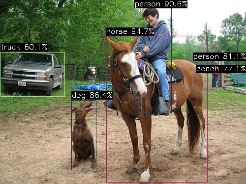
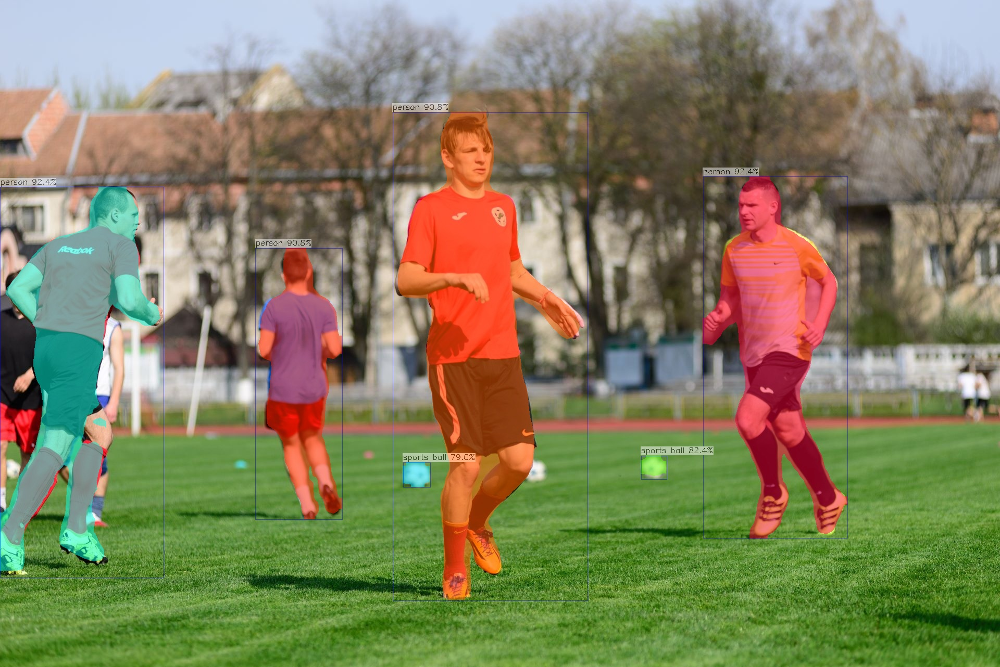
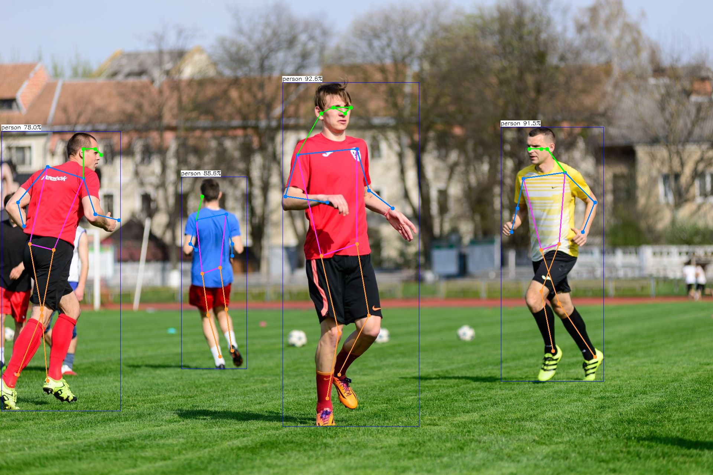
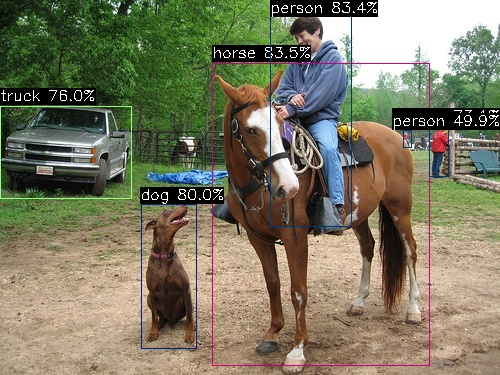
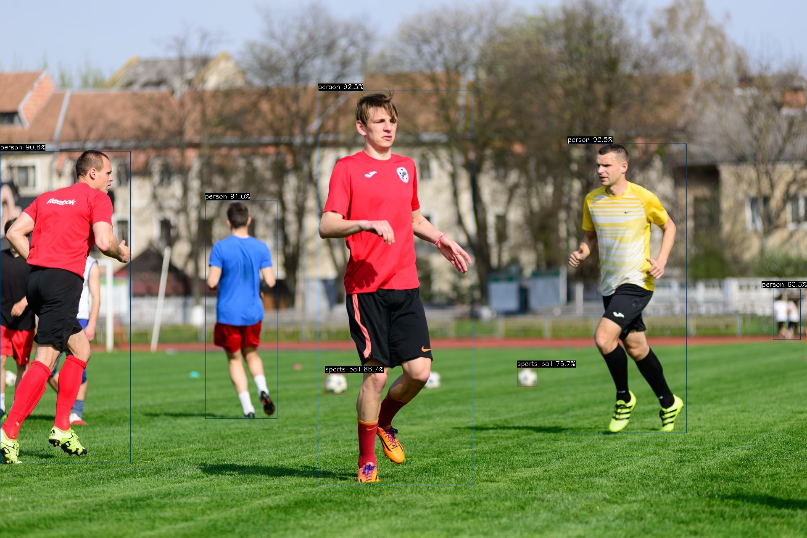

# examples

AX-Samples 将不断更新最流行、实用、有趣的 AX637 示例代码。以下列表覆盖当前 `examples/ax637` 目录中已经提供的应用，后续会随着模型支持一起扩充。

- 物体检测
  - [YOLOv5s](#YOLOv5s)
  - [YOLO11s](#YOLO11s)
  - [YOLOv8](#YOLOv8)
- 实例分割
  - [YOLO11-Seg](#YOLO11-Seg)
- 人体关键点
  - [YOLO11-Pose](#YOLO11-Pose)

### 运行示例

#### YOLO11s
```
root@m57:/mnt/oss/npu-ci/laguna # ./install/ax_yolo11 -m ./models/yolo11/compiled.axmodel -i ./model/yolo11/ssd_ho
rse.jpg
--------------------------------------
model file : ./models/yolo11/compiled.axmodel
image file : ./model/yolo11/ssd_horse.jpg
img_h, img_w : 640 640
--------------------------------------
Engine creating handle is done.
Engine creating context is done.
Engine get io info is done.
Engine alloc io is done.
Engine push input is done.
--------------------------------------
post process cost time:23.75 ms
--------------------------------------
Repeat 1 times, avg time 10.38 ms, max_time 10.38 ms, min_time 10.38 ms
--------------------------------------
detection num: 6
17:  95%, [ 216,   73,  421,  373], horse
 0:  91%, [ 274,   14,  349,  231], person
16:  86%, [ 145,  204,  196,  347], dog
 0:  81%, [ 431,  124,  450,  178], person
13:  77%, [ 469,  149,  499,  179], bench
 7:  60%, [   1,  106,  133,  197], truck
--------------------------------------
```


#### YOLO11-Seg
```
root@m57:/mnt/oss/npu-ci/laguna # ./install/ax_yolo11_seg  -m ./models/yolo11_seg/compiled.axmodel -i ./model/yolo11_seg/football.jpg
--------------------------------------
model file : ./models/yolo11_seg/compiled.axmodel
image file : ./model/yolo11_seg/football.jpg
img_h, img_w : 640 640
--------------------------------------
Engine creating handle is done.
Engine creating context is done.
Engine get io info is done.
Engine alloc io is done.
Engine push input is done.
--------------------------------------

input size: 1
    name:   images [UINT8] [BGR]
        1 x 640 x 640 x 3


output size: 7
    name: /model.23/Concat_1_output_0 [FLOAT32]
        1 x 80 x 80 x 144

    name: /model.23/Concat_2_output_0 [FLOAT32]
        1 x 40 x 40 x 144

    name: /model.23/Concat_3_output_0 [FLOAT32]
        1 x 20 x 20 x 144

    name: /model.23/cv4.0/cv4.0.2/Conv_output_0 [FLOAT32]
        1 x 80 x 80 x 32

    name: /model.23/cv4.1/cv4.1.2/Conv_output_0 [FLOAT32]
        1 x 40 x 40 x 32

    name: /model.23/cv4.2/cv4.2.2/Conv_output_0 [FLOAT32]
        1 x 20 x 20 x 32

    name:  output1 [FLOAT32]
        1 x 32 x 160 x 160

post process cost time:36.42 ms
--------------------------------------
Repeat 1 times, avg time 13.76 ms, max_time 13.76 ms, min_time 13.76 ms
--------------------------------------
detection num: 6
 0:  92%, [1350,  339, 1628, 1036], person
 0:  92%, [   0,  359,  315, 1111], person
 0:  91%, [ 754,  216, 1129, 1155], person
 0:  91%, [ 490,  477,  658,  999], person
32:  82%, [1231,  876, 1281,  922], sports ball
32:  79%, [ 774,  889,  826,  937], sports ball
--------------------------------------
```


#### YOLO11-Pose
```
root@m57:/mnt/oss/npu-ci/laguna # ./install/ax_yolo11_pose  -m ./models/yolo11_pose/compiled.axmodel -i ./model/yo
lo11_pose/football.jpg
--------------------------------------
model file : ./models/yolo11_pose/compiled.axmodel
image file : ./model/yolo11_pose/football.jpg
img_h, img_w : 640 640
--------------------------------------
Engine creating handle is done.
Engine creating context is done.
Engine get io info is done.
Engine alloc io is done.
Engine push input is done.
--------------------------------------
post process cost time:1.36 ms
--------------------------------------
Repeat 1 times, avg time 10.76 ms, max_time 10.76 ms, min_time 10.76 ms
--------------------------------------
detection num: 4
 0:  93%, [ 761,  222, 1129, 1152], person
 0:  91%, [1349,  343, 1626, 1030], person
 0:  89%, [ 488,  477,  665,  996], person
 0:  78%, [   4,  354,  324, 1110], person
--------------------------------------
```


#### YOLOv5s
```
root@m57:/mnt/oss/npu-ci/laguna # ./install/ax_yolov5s  -m ./models/yolov5s/yolov5s.axmodel  -i ./models/yolov5s/ssd_horse.jpg
--------------------------------------
model file : ./models/yolov5s/yolov5s.axmodel
image file : ./models/yolov5s/ssd_horse.jpg
img_h, img_w : 640 640
--------------------------------------
Engine creating handle is done.
Engine creating context is done.
Engine get io info is done.
Engine alloc io is done.
Engine push input is done.
--------------------------------------
post process cost time:1.70 ms
--------------------------------------
Repeat 1 times, avg time 7.29 ms, max_time 7.29 ms, min_time 7.29 ms
--------------------------------------
detection num: 6
17:  84%, [ 212,   63,  430,  366], horse
 0:  83%, [ 270,   12,  352,  227], person
16:  80%, [ 141,  204,  197,  350], dog
 7:  76%, [   0,  106,  132,  199], truck
 0:  73%, [ 429,  125,  449,  178], person
 0:  50%, [ 403,  130,  412,  148], person
--------------------------------------
```


#### YOLOv8
```
root@m57:/mnt/oss/npu-ci/laguna # ./install/ax_yolov8 -m ./models/yolov8/yolov8.axmodel -i ./models/yolov8/football.jpg
--------------------------------------
model file : ./models/yolov8/yolov8.axmodel
image file : ./models/yolov8/football.jpg
img_h, img_w : 640 640
--------------------------------------
Engine creating handle is done.
Engine creating context is done.
Engine get io info is done.
Engine alloc io is done.
Engine push input is done.
--------------------------------------
post process cost time:4.89 ms
--------------------------------------
Repeat 1 times, avg time 11.33 ms, max_time 11.33 ms, min_time 11.33 ms
--------------------------------------
detection num: 7
 0:  93%, [ 756,  216, 1126, 1156], person
 0:  93%, [1351,  342, 1633, 1032], person
 0:  91%, [ 488,  478,  659,  998], person
 0:  91%, [   0,  360,  311, 1104], person
32:  87%, [ 773,  890,  828,  939], sports ball
32:  77%, [1231,  876, 1280,  923], sports ball
 0:  60%, [1839,  688, 1905,  809], person
--------------------------------------
```
