# examples

AX-Samples 将不断更新最流行的、实用的、有趣的示例代码。

- 物体检测
  - [PP-YOLOv3](#yolov3paddle)
  - [YOLOv5s](#YOLOv5s)
  - [YOLOv7-Tiny](#YOLOv7-Tiny)
  - [YOLOv8s](#YOLOv8s)
  - [YOLOX-S](#YOLOX-S)
- 物体分割
  - YOLOv5-seg
- 人脸检测
  - [scrfd](#Scrfd)
  - [YOLOv5-Face](#YOLOv5-Face)([original model](https://github.com/deepcam-cn/yolov5-face))
  - [YOLOv7-Face](#YOLOv7-Face)
- 无人机视角物体检测
  - [YOLOv5s_visdrone](#YOLOv5s_visdrone)
- 人体关键点
  - [HRNet](#HRNet)
- 人体分割
  - [PP-HumanSeg](#PP-HumanSeg)


### 运行示例

#### YOLOv5s
```
root@AXERA:/home/test# ./ax_yolov5s -m yolov5s.axmodel -i test.jpg
--------------------------------------
model file : yolov5s.axmodel
image file : test.jpg
img_h, img_w : 640 640
--------------------------------------
[Axera version]: libax_sys.so V1.13.0 Apr 26 2023 16:24:35
Engine creating handle is done.
Engine creating context is done.
Engine get io info is done.
Engine alloc io is done.
Engine push input is done.
--------------------------------------
post process cost time:2.03 ms
--------------------------------------
Repeat 1 times, avg time 2.89 ms, max_time 2.89 ms, min_time 2.89 ms
--------------------------------------
detection num: 11
 0:  92%, [ 173,  309,  367,  815], person
 0:  84%, [ 495,  302,  677,  785], person
14:  82%, [ 745,  611,  802,  648], bird
 0:  82%, [  91,  284,  191,  499], person
 0:  79%, [ 612,  275,  695,  470], person
16:  79%, [ 316,  562,  469,  821], dog
 5:  77%, [ 863,  148, 1196,  493], bus
 0:  72%, [ 444,  292,  493,  443], person
 2:  63%, [1200,  293, 1279,  401], car
 2:  61%, [ 810,  271,  869,  332], car
 0:  53%, [ 742,  304,  768,  386], person
--------------------------------------
```
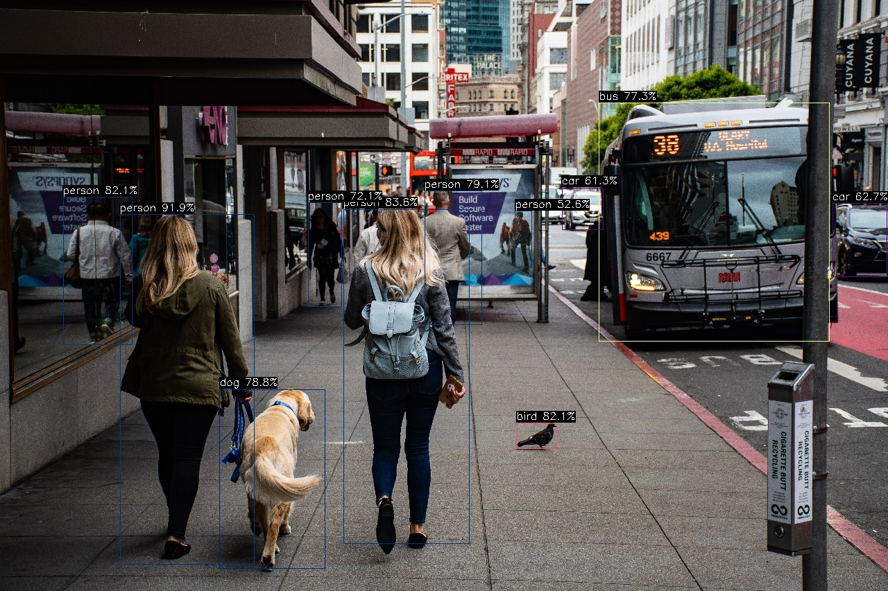

#### YOLOv7-Tiny
```
root@AXERA:/home/test# ./ax_yolov7 -m yolov7-tiny.axmodel -i test.jpg
--------------------------------------
model file : yolov7-tiny.axmodel
image file : test.jpg
img_h, img_w : 640 640
--------------------------------------
[Axera version]: libax_sys.so V1.13.0 Apr 26 2023 16:24:35
Engine creating handle is done.
Engine creating context is done.
Engine get io info is done.
Engine alloc io is done.
Engine push input is done.
--------------------------------------
post process cost time:1.89 ms
--------------------------------------
Repeat 1 times, avg time 7.03 ms, max_time 7.03 ms, min_time 7.03 ms
--------------------------------------
detection num: 12
 0:  92%, [ 177,  314,  360,  803], person
 0:  89%, [ 503,  282,  669,  807], person
 0:  86%, [  89,  297,  195,  491], person
14:  82%, [ 746,  607,  801,  652], bird
 0:  76%, [ 444,  294,  494,  440], person
 5:  74%, [ 868,  125, 1272,  502], bus
26:  66%, [ 515,  369,  628,  547], handbag
 0:  65%, [ 602,  278,  696,  470], person
 0:  64%, [ 734,  301,  767,  384], person
 0:  61%, [ 326,  557,  466,  826], person
 0:  57%, [ 841,  308,  879,  439], person
 2:  57%, [ 812,  276,  867,  334], car
--------------------------------------
```
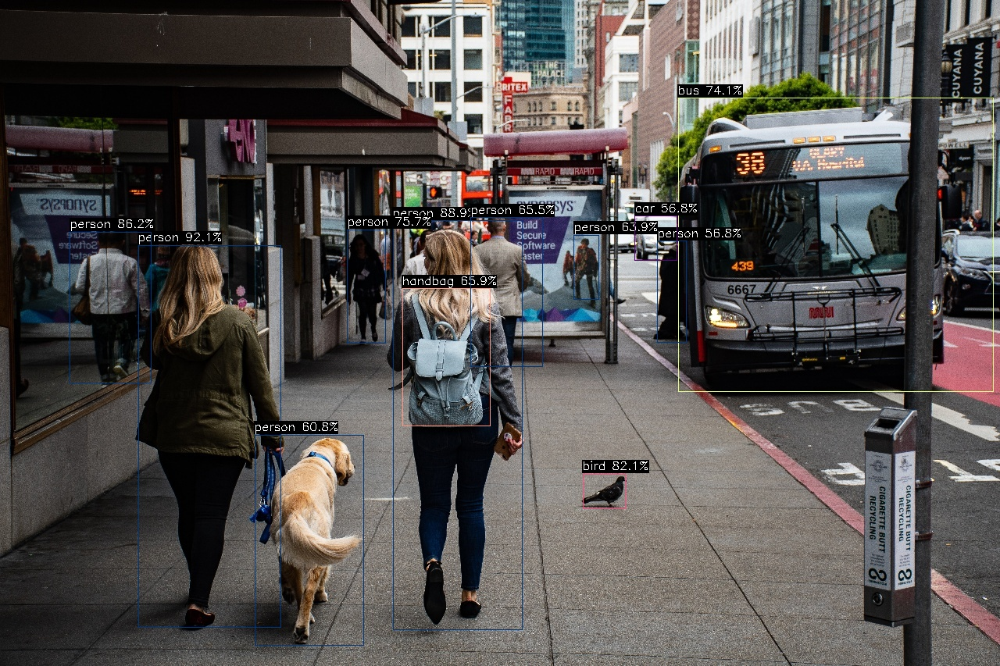

#### YOLOX-S
```
/tmp/samples # ./ax_yoloxs -m yolox_s_cut.joint -i dog.jpg -r 10
--------------------------------------
model file : yolox_s_cut.joint
image file : dog.jpg
img_h, img_w : 640 640
Run-Joint Runtime version: 0.5.8
--------------------------------------
[INFO]: Virtual npu mode is 1_1

Tools version: 0.6.0.32
8a011dfa
run over: output len 3
--------------------------------------
Create handle took 497.16 ms (neu 23.64 ms, axe 0.00 ms, overhead 473.52 ms)
--------------------------------------
Repeat 10 times, avg time 41.65 ms, max_time 42.37 ms, min_time 41.55 ms
--------------------------------------
detection num: 4
 1:  97%, [ 123,  119,  569,  417], bicycle
16:  95%, [ 136,  222,  307,  540], dog
 7:  72%, [ 470,   75,  688,  171], truck
58:  53%, [ 685,  111,  716,  154], potted plant
```

#### Scrfd
```
root@AXERA:/home/test# ./ax_scrfd -m scrfd_500m_bnkps_shape640x640.axmodel -i selfie.jpg
--------------------------------------
model file : scrfd_500m_bnkps_shape640x640.axmodel
image file : selfie.jpg
img_h, img_w : 640 640
--------------------------------------
[Axera version]: libax_sys.so V1.13.0 Apr 26 2023 16:24:35
Engine creating handle is done.
Engine creating context is done.
Engine get io info is done.
Engine alloc io is done.
Engine push input is done.
--------------------------------------
post process cost time:2.46 ms
--------------------------------------
Repeat 1 times, avg time 1.44 ms, max_time 1.44 ms, min_time 1.44 ms
--------------------------------------
detection num: 117
--------------------------------------
```
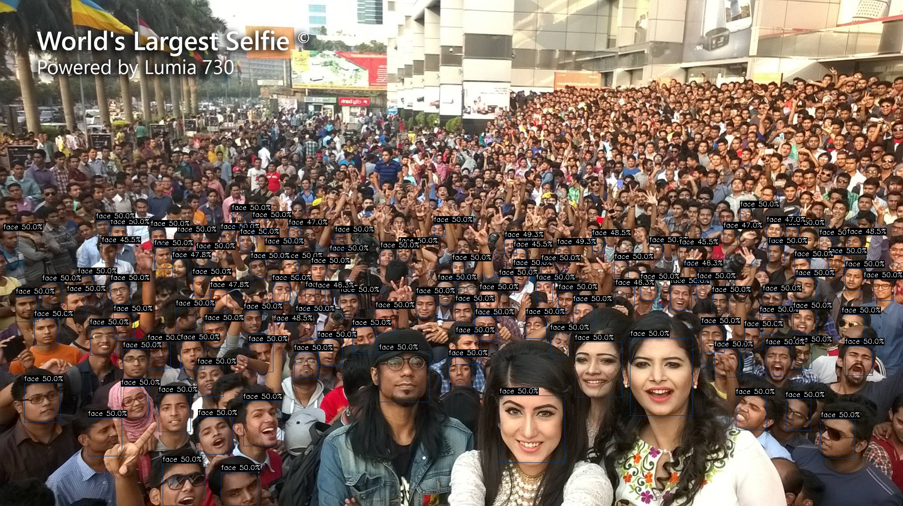

#### YOLOv5-Face
```
root@AXERA:/home/test# ./ax_yolov5_face -m yolov5s-face.axmodel -i selfie.jpg
--------------------------------------
model file : yolov5s-face.axmodel
image file : selfie.jpg
img_h, img_w : 640 640
--------------------------------------
[Axera version]: libax_sys.so V1.13.0 Apr 26 2023 16:24:35
Engine creating handle is done.
Engine creating context is done.
Engine get io info is done.
Engine alloc io is done.
Engine push input is done.
--------------------------------------
post process cost time:4.58 ms
--------------------------------------
Repeat 1 times, avg time 7.76 ms, max_time 7.76 ms, min_time 7.76 ms
--------------------------------------
detection num: 117
```
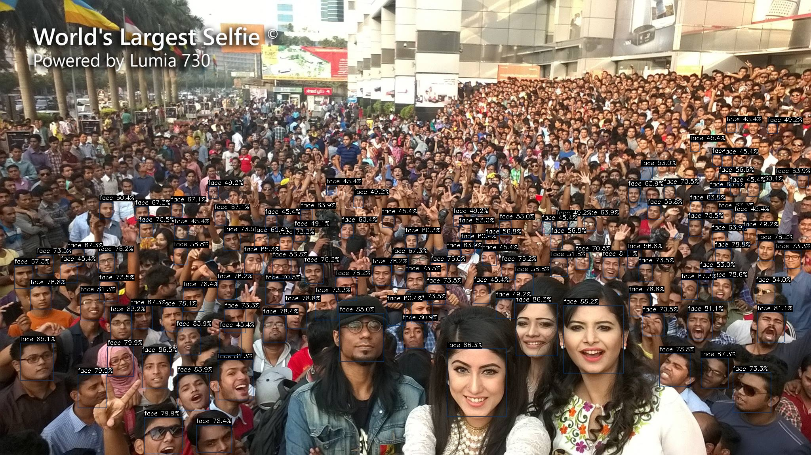


#### YOLOv5-Seg
```
root@AXERA:/home/test# ./ax_yolov5s_seg -m yolov5s-seg.axmodel -i test.jpg
--------------------------------------
model file : yolov5s-seg.axmodel
image file : test.jpg
img_h, img_w : 640 640
--------------------------------------
[Axera version]: libax_sys.so V1.13.0 Apr 26 2023 16:24:35
Engine creating handle is done.
Engine creating context is done.
Engine get io info is done.
Engine alloc io is done.
Engine push input is done.
--------------------------------------
post process cost time:8.62 ms
--------------------------------------
Repeat 1 times, avg time 11.01 ms, max_time 11.01 ms, min_time 11.01 ms
--------------------------------------
detection num: 12
 0:  89%, [ 172,  315,  375,  809], person
 0:  85%, [ 499,  295,  673,  816], person
 0:  82%, [  87,  291,  195,  489], person
 0:  79%, [ 444,  295,  496,  442], person
14:  75%, [ 743,  609,  803,  651], bird
 5:  75%, [ 867,  152, 1257,  488], bus
 0:  65%, [ 603,  270,  695,  479], person
16:  61%, [ 318,  566,  470,  824], dog
 0:  56%, [ 838,  305,  879,  437], person
 2:  54%, [ 815,  273,  869,  329], car
 0:  51%, [ 729,  305,  768,  380], person
 0:  46%, [  21,  301,   54,  394], person
--------------------------------------
```
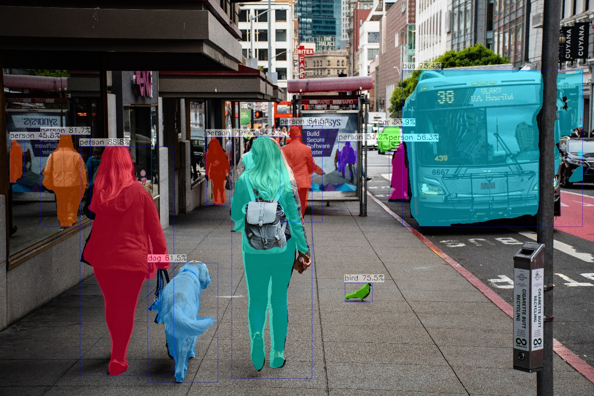

#### YOLOv7-Face
```
root@AXERA:/home/test# ./ax_yolov7_tiny_face -m yolov7-tiny-face.axmodel -i selfie.jpg
--------------------------------------
model file : yolov7-tiny-face.axmodel
image file : selfie.jpg
img_h, img_w : 640 640
--------------------------------------
[Axera version]: libax_sys.so V1.13.0 Apr 26 2023 16:24:35
Engine creating handle is done.
Engine creating context is done.
Engine get io info is done.
Engine alloc io is done.
Engine push input is done.
--------------------------------------
post process cost time:4.35 ms
--------------------------------------
Repeat 1 times, avg time 8.95 ms, max_time 8.95 ms, min_time 8.95 ms
--------------------------------------
detection num: 103
```
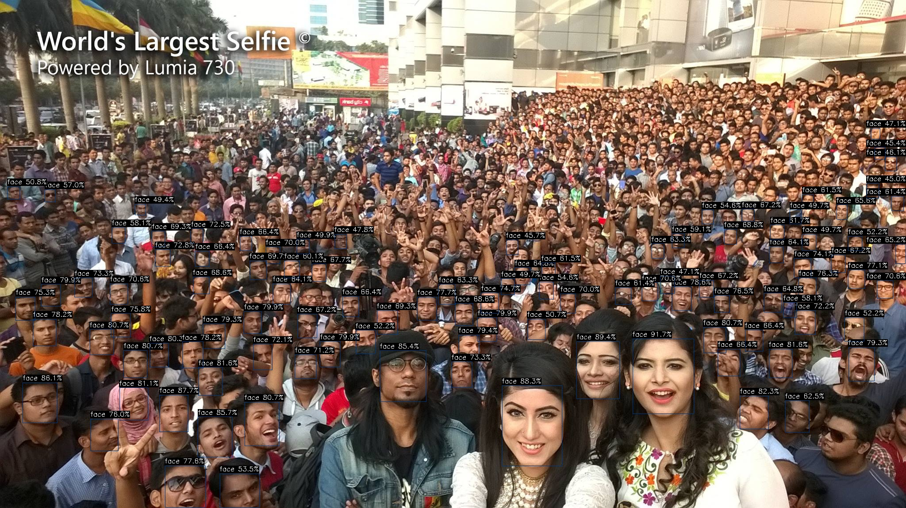

#### YOLOv6s
```
root@AXERA:/home/test# ./ax_yolov6 -m yolov6s.axmodel -i test.jpg
--------------------------------------
model file : yolov6s.axmodel
image file : test.jpg
img_h, img_w : 640 640
--------------------------------------
[Axera version]: libax_sys.so V1.13.0 Apr 26 2023 16:24:35
Engine creating handle is done.
Engine creating context is done.
Engine get io info is done.
Engine alloc io is done.
Engine push input is done.
--------------------------------------
post process cost time:3.13 ms
--------------------------------------
Repeat 1 times, avg time 13.15 ms, max_time 13.15 ms, min_time 13.15 ms
--------------------------------------
detection num: 13
 0:  94%, [ 171,  306,  370,  809], person
 0:  93%, [  85,  291,  191,  493], person
 0:  89%, [ 491,  292,  676,  802], person
14:  87%, [ 324,  558,  467,  825], bird
 5:  83%, [ 869,  135, 1242,  496], bus
 0:  81%, [ 607,  272,  686,  463], person
 0:  75%, [ 444,  300,  496,  439], person
14:  70%, [ 744,  608,  803,  651], bird
 0:  69%, [ 732,  303,  766,  385], person
 2:  64%, [1206,  287, 1279,  405], car
24:  58%, [ 521,  381,  624,  550], backpack
 7:  53%, [ 814,  273,  870,  331], truck
 0:  53%, [ 183,  299,  224,  396], person
--------------------------------------
```
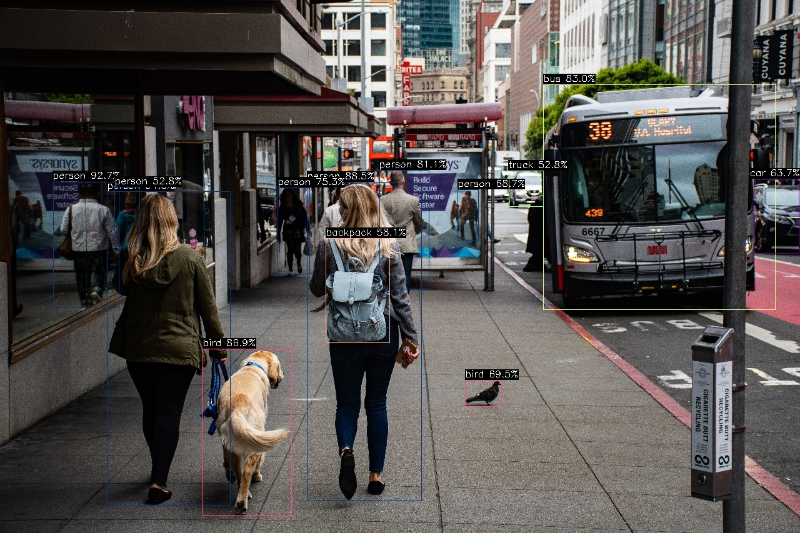

#### YOLOv8s
```
root@AXERA:/home/test# ./ax_yolov8s -m yolov8s.axmodel -i test.jpg
--------------------------------------
model file : yolov8s.axmodel
image file : test.jpg
img_h, img_w : 640 640
--------------------------------------
[Axera version]: libax_sys.so V1.13.0 Apr 26 2023 16:24:35
Engine creating handle is done.
Engine creating context is done.
Engine get io info is done.
Engine alloc io is done.
Engine push input is done.
--------------------------------------
post process cost time:3.14 ms
--------------------------------------
Repeat 1 times, avg time 12.89 ms, max_time 12.89 ms, min_time 12.89 ms
--------------------------------------
detection num: 11
 0:  92%, [ 172,  311,  367,  812], person
 0:  87%, [ 496,  287,  671,  798], person
 5:  84%, [ 863,  146, 1232,  492], bus
 0:  84%, [  89,  290,  191,  491], person
14:  79%, [ 744,  610,  803,  649], bird
 0:  79%, [ 610,  275,  679,  464], person
 0:  79%, [ 442,  297,  495,  441], person
 0:  63%, [ 838,  310,  878,  434], person
14:  63%, [ 335,  561,  462,  826], bird
 7:  50%, [ 813,  275,  870,  333], truck
26:  50%, [  90,  325,  120,  419], handbag
```


#### YOLOX-S
```
root@AXERA:/home/test# ./ax_yolox -m yolox.axmodel -i test.jpg
--------------------------------------
model file : yolox.axmodel
image file : test.jpg
img_h, img_w : 640 640
--------------------------------------
[Axera version]: libax_sys.so V1.13.0 Apr 26 2023 16:24:35
Engine creating handle is done.
Engine creating context is done.
Engine get io info is done.
Engine alloc io is done.
Engine push input is done.
--------------------------------------
post process cost time:0.82 ms
--------------------------------------
Repeat 1 times, avg time 10.84 ms, max_time 10.84 ms, min_time 10.84 ms
--------------------------------------
detection num: 14
16:  92%, [ 329,  556,  459,  826], dog
 0:  92%, [ 173,  310,  364,  818], person
 0:  90%, [ 494,  286,  672,  806], person
 5:  88%, [ 874,  145, 1235,  492], bus
 0:  88%, [ 441,  299,  496,  440], person
 0:  83%, [  88,  294,  192,  488], person
 2:  74%, [ 814,  273,  869,  333], car
 0:  73%, [ 733,  302,  768,  392], person
 0:  73%, [ 608,  277,  681,  462], person
14:  72%, [ 743,  608,  804,  649], bird
 2:  70%, [1210,  292, 1279,  402], car
24:  57%, [ 518,  411,  627,  553], backpack
 0:  55%, [ 185,  297,  223,  399], person
26:  48%, [  88,  340,  118,  411], handbag
--------------------------------------
```
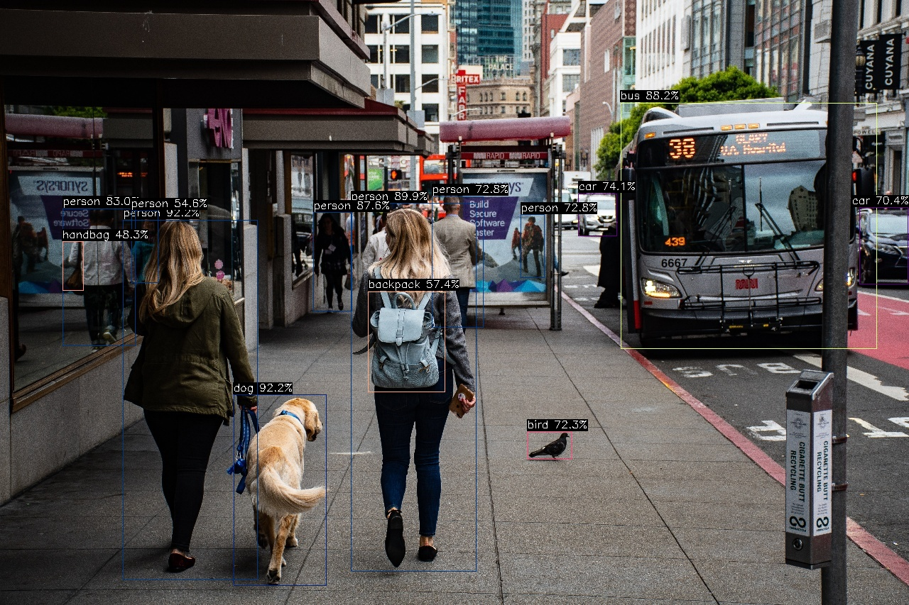

#### YOLO-NAS
```
root@AXERA:/home/test# ./ax_yolo_nas -m yolonas.axmodel -i airport.jpg
--------------------------------------
model file : yolonas.axmodel
image file : airport.jpg
img_h, img_w : 640 640
--------------------------------------
[Axera version]: libax_sys.so V1.13.0 Apr 26 2023 16:24:35
Engine creating handle is done.
Engine creating context is done.
Engine get io info is done.
Engine alloc io is done.
Engine push input is done.
--------------------------------------
post process cost time:3.13 ms
--------------------------------------
Repeat 1 times, avg time 12.88 ms, max_time 12.88 ms, min_time 12.88 ms
--------------------------------------
detection num: 6
 4:  59%, [ 130,  176,  297,  228], airplane
 4:  59%, [ 281,  193,  363,  223], airplane
 5:  59%, [ 462,  142,  639,  418], bus
 5:  59%, [ 374,  199,  464,  268], bus
 0:  50%, [ 216,  229,  230,  264], person
 0:  50%, [ 490,  228,  555,  279], person
--------------------------------------
```
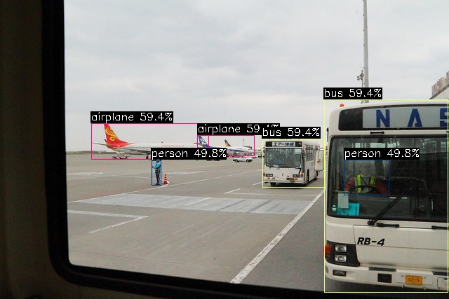

#### HRNet
```
root@AXERA:/home/test# ./ax_hrnet -m hrnet_256x192.axmodel -i apic33179.jpg
--------------------------------------
model file : hrnet_256x192.axmodel
image file : apic33179.jpg
img_h, img_w : 256 192
--------------------------------------
[Axera version]: libax_sys.so V1.13.0 Apr 26 2023 16:24:35
Engine creating handle is done.
Engine creating context is done.
Engine get io info is done.
Engine alloc io is done.
Engine push input is done.
--------------------------------------
post process cost time:0.23 ms
--------------------------------------
Repeat 1 times, avg time 5.16 ms, max_time 5.16 ms, min_time 5.16 ms
--------------------------------------
```
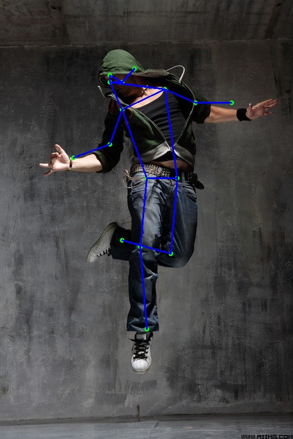

### SegFormer
```
/opt/test # ./ax_segformer -m segformer-b0-finetuned-cityscapes-640-1280.axmodel
 -i test.png
--------------------------------------
model file : segformer-b0-finetuned-cityscapes-640-1280.axmodel
image file : test.png
img_h, img_w : 640 1280
--------------------------------------
[Axera version]: libax_sys.so V1.14.0_20230506154237 May  6 2023 15:43:14 JK
Engine creating handle is done.
Engine creating context is done.
Engine get io info is done.
Engine alloc io is done.
Engine push input is done.
--------------------------------------
post process cost time:2.28 ms
--------------------------------------
Repeat 1 times, avg time 115.85 ms, max_time 115.85 ms, min_time 115.85 ms
--------------------------------------
```
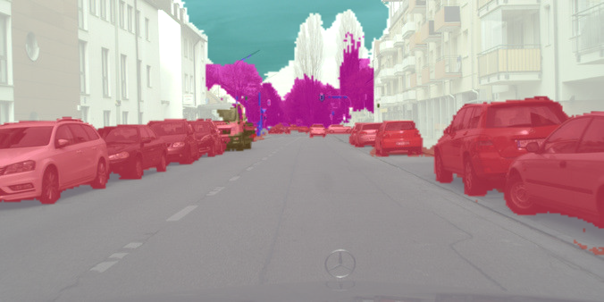

### PFLD
```
/opt/test # ./ax_pfld -m pfld.axmodel -i liming.png -r 100
--------------------------------------
model file : pfld.axmodel
image file : liming.png
img_h, img_w : 112 112
--------------------------------------
[Axera version]: libax_sys.so V1.14.0_20230506154237 May  6 2023 15:43:14 JK
Engine creating handle is done.
Engine creating context is done.
Engine get io info is done.
Engine alloc io is done.
Engine push input is done.
--------------------------------------
post process cost time:0.72 ms
--------------------------------------
Repeat 100 times, avg time 0.44 ms, max_time 0.45 ms, min_time 0.44 ms
--------------------------------------
```
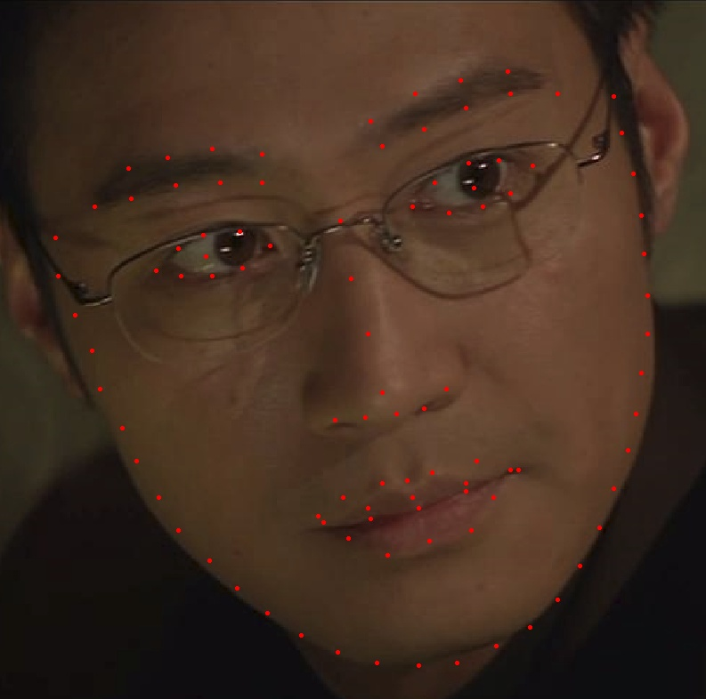

### YOLOV8-POSE
```
/opt/test # ./ax_yolov8_pose -m yolov8s-pose.axmodel -i test.jpg
--------------------------------------
model file : yolov8s-pose.axmodel
image file : test.jpg
img_h, img_w : 640 640
--------------------------------------
[Axera version]: libax_sys.so V1.14.0_20230506154237 May  6 2023 15:43:14 JK
Engine creating handle is done.
Engine creating context is done.
Engine get io info is done.
Engine alloc io is done.
Engine push input is done.
--------------------------------------
post process cost time:0.28 ms
--------------------------------------
Repeat 1 times, avg time 12.77 ms, max_time 12.77 ms, min_time 12.77 ms
--------------------------------------
detection num: 5
 0:  92%, [ 497,  291,  673,  804], person
 0:  90%, [ 175,  306,  365,  804], person
 0:  86%, [  89,  292,  192,  490], person
 0:  77%, [ 608,  271,  693,  465], person
 0:  55%, [ 443,  296,  498,  440], person
--------------------------------------
```
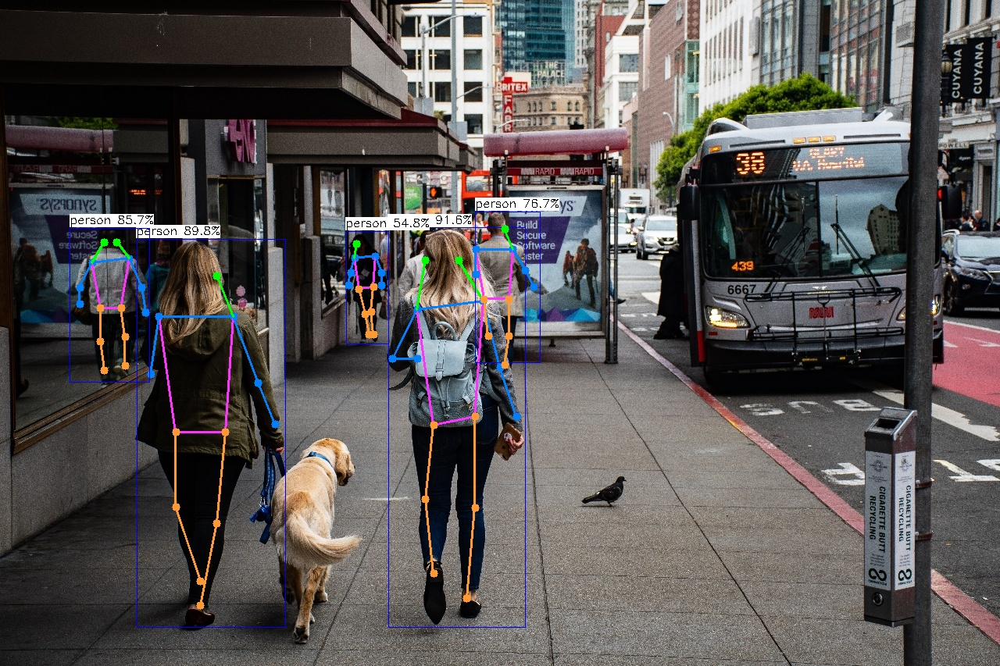

### DinoV2
```
/opt/test # ./ax_dinov2 -m dinov2_small_518_precision_opt.axmodel -i dog-chai.jpeg
--------------------------------------
model file : dinov2_small_518_precision_opt.axmodel
image file : dog-chai.jpeg
img_h, img_w : 518 518
--------------------------------------
[Axera version]: libax_sys.so V1.14.0_20230506154237 May  6 2023 15:43:14 JK
Engine creating handle is done.
Engine creating context is done.
Engine get io info is done.
Engine alloc io is done.
Engine push input is done.
--------------------------------------
post process cost time:8454.33 ms
--------------------------------------
Repeat 1 times, avg time 28.64 ms, max_time 28.64 ms, min_time 28.64 ms
--------------------------------------
```
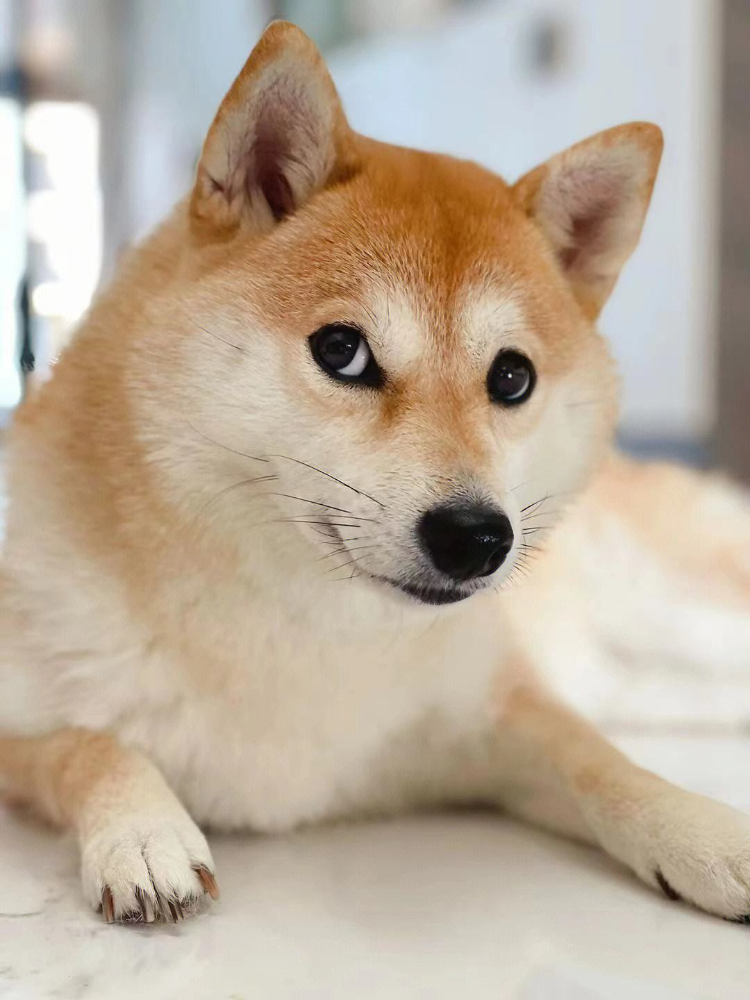
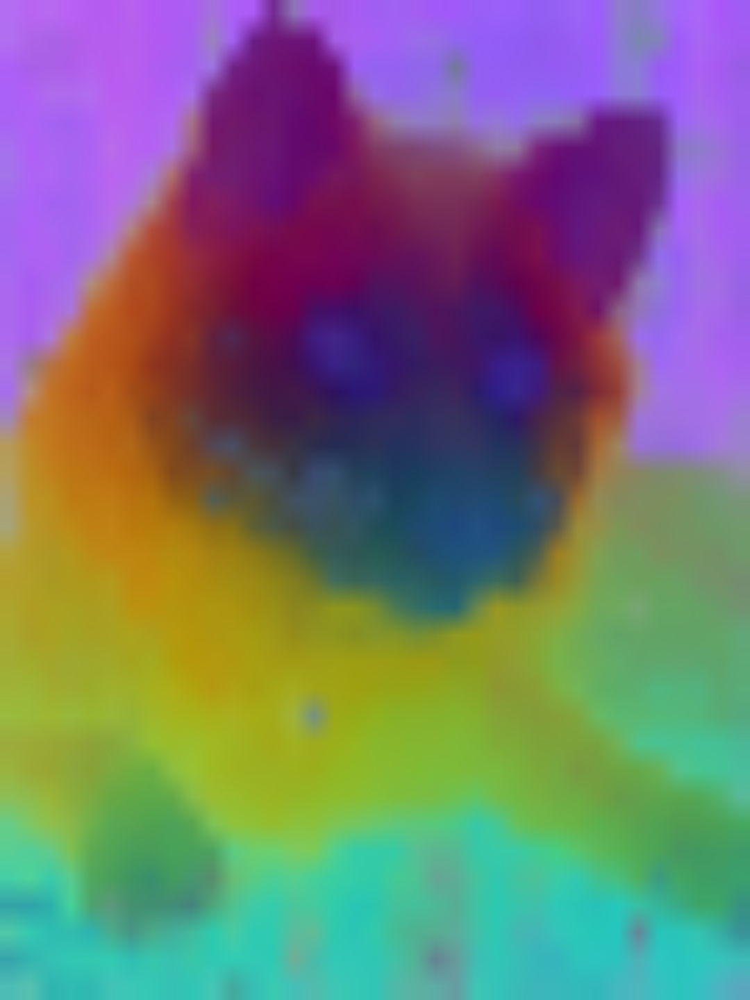

### Simcc
```
/opt/test # ./ax_simcc_pose -m simcc-76fe95.axmodel -i R-C.jpg
--------------------------------------
model file : simcc-76fe95.axmodel
image file : R-C.jpg
img_h, img_w : 256 192
--------------------------------------
[Axera version]: libax_sys.so V1.14.0_20230506154237 May  6 2023 15:43:14 JK
Engine creating handle is done.
Engine creating context is done.
Engine get io info is done.
Engine alloc io is done.
Engine push input is done.
--------------------------------------
post process cost time:0.07 ms
--------------------------------------
Repeat 1 times, avg time 4.79 ms, max_time 4.79 ms, min_time 4.79 ms
--------------------------------------
```
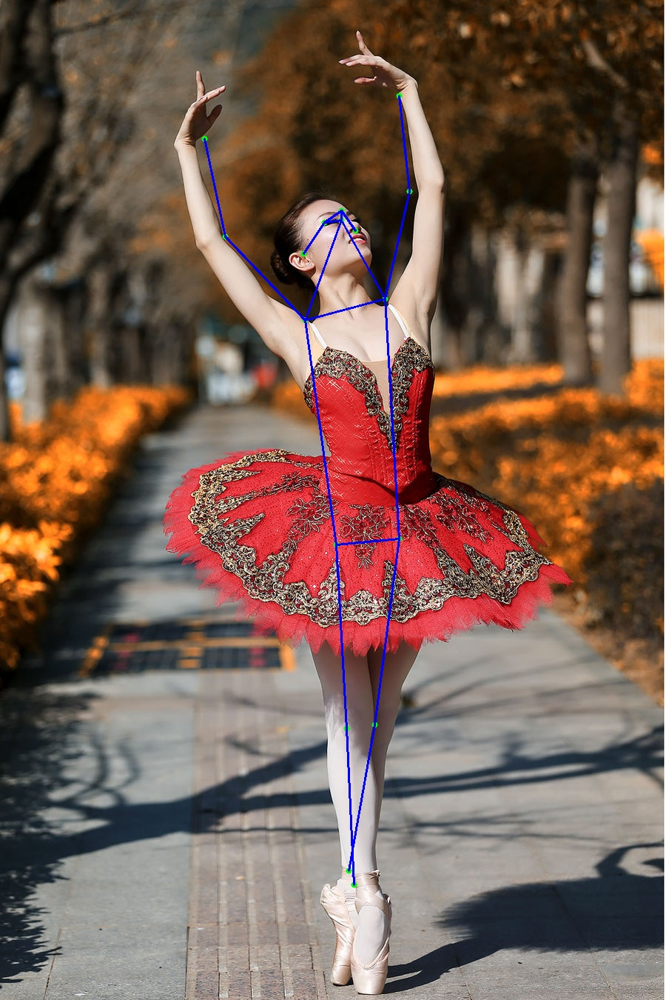

### GLPDepth
```
/opt/test # ./ax_glpdepth -m install/bin/models/glpdepth_896x1152.axmodel -i test.jpg
--------------------------------------
model file : install/bin/models/glpdepth_896x1152.axmodel
image file : test.jpg
img_h, img_w : 896 1152
--------------------------------------
Engine creating handle is done.
Engine creating context is done.
Engine get io info is done.
Engine alloc io is done.
Engine push input is done.
--------------------------------------
post process cost time:29.89 ms
--------------------------------------
Repeat 1 times, avg time 258.29 ms, max_time 258.29 ms, min_time 258.29 ms
--------------------------------------
```
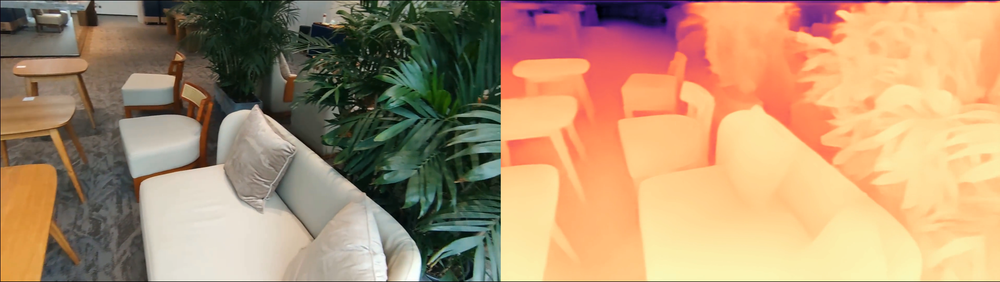

### YoloV8-Seg
```
/opt/test # ./ax_yolov8_seg -m yolov8n_seg.axmodel -i ssd_horse.jpg
--------------------------------------
model file : yolov8n_seg.axmodel
image file : ssd_horse.jpg
img_h, img_w : 640 640
--------------------------------------
Engine creating handle is done.
Engine creating context is done.
Engine get io info is done.
Engine alloc io is done.
Engine push input is done.
--------------------------------------

input size: 1
    name:   images [UINT8]
        1 x 640 x 640 x 3


output size: 7
    name:  output1 [FLOAT32]
        1 x 32 x 160 x 160

    name: /model.22/cv4.0/cv4.0.2/Conv_output_0 [FLOAT32]
        1 x 80 x 80 x 32

    name: /model.22/cv4.1/cv4.1.2/Conv_output_0 [FLOAT32]
        1 x 40 x 40 x 32

    name: /model.22/cv4.2/cv4.2.2/Conv_output_0 [FLOAT32]
        1 x 20 x 20 x 32

    name: /model.22/Concat_1_output_0 [FLOAT32]
        1 x 80 x 80 x 144

    name: /model.22/Concat_2_output_0 [FLOAT32]
        1 x 40 x 40 x 144

    name: /model.22/Concat_3_output_0 [FLOAT32]
        1 x 20 x 20 x 144

post process cost time:8.62 ms
--------------------------------------
Repeat 1 times, avg time 5.16 ms, max_time 5.16 ms, min_time 5.16 ms
--------------------------------------
detection num: 5
17:  90%, [ 214,   75,  419,  369], horse
 0:  83%, [ 272,   13,  349,  232], person
 7:  77%, [   0,  105,  133,  196], truck
 0:  77%, [ 427,  125,  451,  175], person
16:  69%, [ 144,  203,  195,  343], dog
--------------------------------------
```
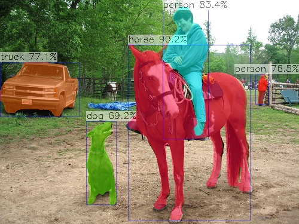