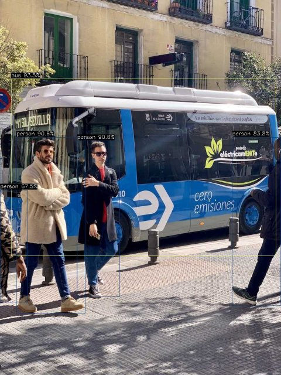
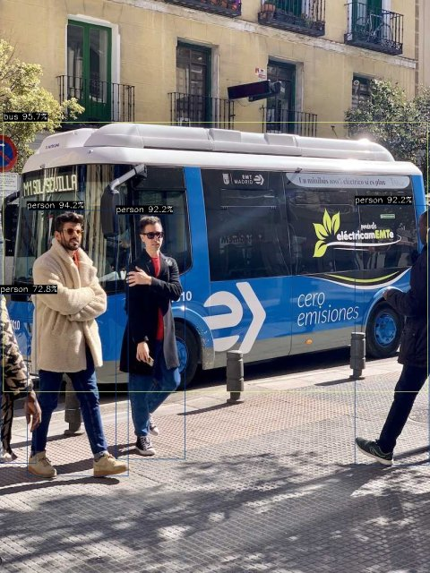
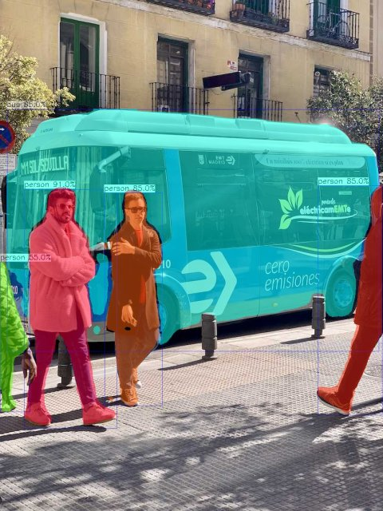
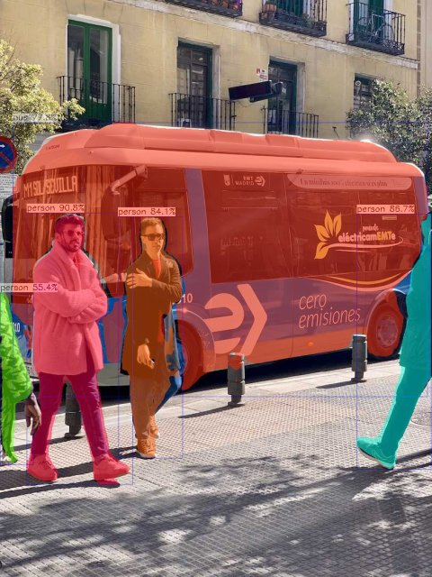
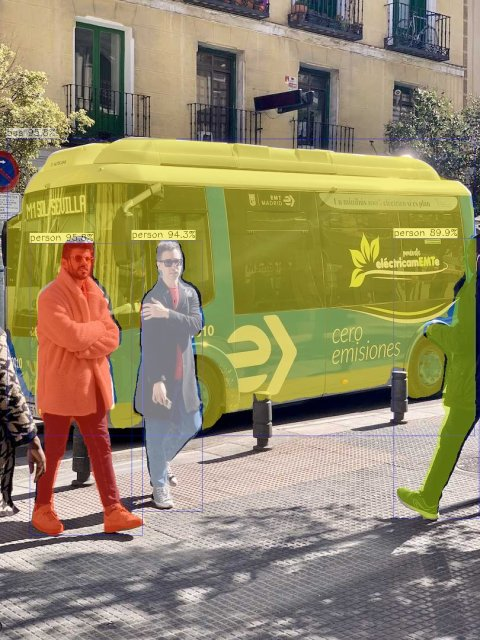
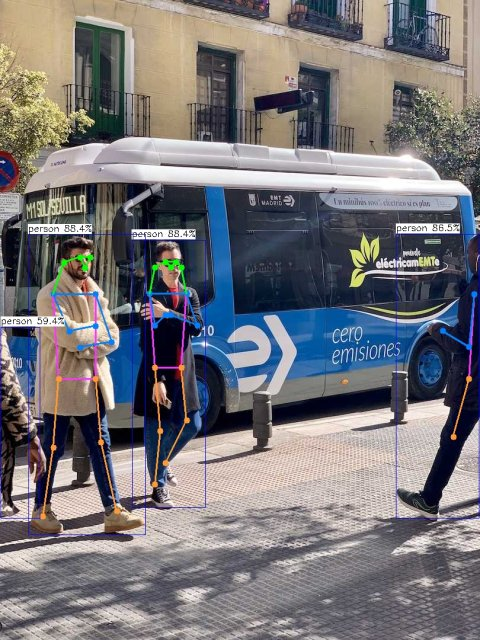
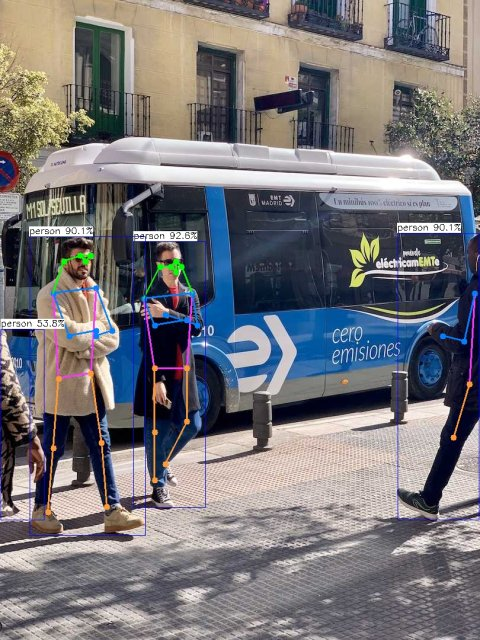
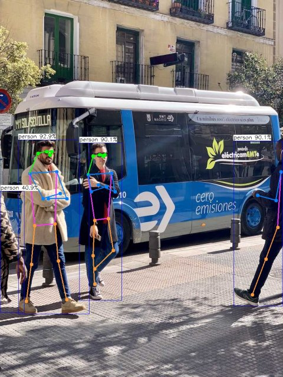

# examples

AX-Samples 将不断更新最流行、实用、有趣的 AX8860 示例代码。以下列表覆盖当前 `examples/ax8860` 目录中已经提供的应用，后续会随着模型支持一起扩充。

- 图像分类
  - [MobileNetv2](#MobileNetv2)
- 物体检测
  - [YOLOv5s](#YOLOv5s)
  - [YOLOv8s](#YOLOv8s)
  - [YOLO11s](#YOLO11s)
  - [YOLO26s](#YOLO26s)
- 物体分割
  - [YOLOv8s-seg](#YOLOv8s-seg)
  - [YOLO11s-seg](#YOLO11s-seg)
  - [YOLO26s-seg](#YOLO26s-seg)
- 人体关键点
  - [YOLOv8s-pose](#YOLOv8s-pose)
  - [YOLO11s-pose](#YOLO11s-pose)
  - [YOLO26s-pose](#YOLO26s-pose)

编译方法见 [compile_8860.md](../../docs/compile_8860.md)。板端 BSP 动态库位于 `/opt/lib`，运行前请确认其在动态库搜索路径中：

```bash
export LD_LIBRARY_PATH=/opt/lib:$LD_LIBRARY_PATH
```

### 模型转换

YOLO 系列模型由 [AXERA-TECH](https://huggingface.co/AXERA-TECH) 发布的 onnx 及其 `config.json` 使用 Pulsar2 7.0 转换，仅需将目标平台改为 AX8860：

```bash
pulsar2 build --config config.json --target_hardware AX8860 --npu_mode NPU4
```

- YOLO11 / YOLO26 系列直接使用原始 onnx。
- YOLOv8 系列的 onnx 为每个 stride 拆分输出（box 64 + cls 80 / 1），需先在 onnx 中将同一 stride 的 box 与 cls 在通道维 Concat，得到与 `ax_yolov8*` 后处理一致的输出：
  - YOLOv8s：3 x (1 x H x W x 144)
  - YOLOv8s-seg：3 x (1 x H x W x 144)，3 x (1 x H x W x 32)，1 x 32 x 160 x 160
  - YOLOv8s-pose：3 x (1 x H x W x 65)，3 x (1 x H x W x 51)

以下 YOLO 示例统一使用 [bus.jpg](https://ultralytics.com/images/bus.jpg) 测试，模型均为 NPU4 模式。

### 运行示例

#### MobileNetv2
```
# ./ax_classification -m models/mobilenetv2.axmodel -i images/cat.jpg -r 10
--------------------------------------
model file : models/mobilenetv2.axmodel
image file : images/cat.jpg
img_h, img_w : 224 224
--------------------------------------
Engine creating handle is done.
Engine creating context is done.
Engine get io info is done.
Engine alloc io is done.
Engine push input is done.
--------------------------------------
topk cost time:0.07 ms
9.2452, 285
9.1132, 282
9.1132, 281
8.4528, 283
7.3962, 463
--------------------------------------
Repeat 10 times, avg time 0.36 ms, max_time 0.38 ms, min_time 0.35 ms
--------------------------------------
```

#### YOLOv5s
```
# ./ax_yolov5s -m models/yolov5s.axmodel -i images/dog.jpg -r 10
--------------------------------------
model file : models/yolov5s.axmodel
image file : images/dog.jpg
img_h, img_w : 640 640
--------------------------------------
Engine creating handle is done.
Engine creating context is done.
Engine get io info is done.
Engine alloc io is done.
Engine push input is done.
--------------------------------------
post process cost time:3.41 ms
--------------------------------------
Repeat 10 times, avg time 1.87 ms, max_time 1.89 ms, min_time 1.87 ms
--------------------------------------
detection num: 3
16:  91%, [ 134,  215,  310,  543], dog
 2:  67%, [ 469,   76,  689,  173], car
 1:  56%, [ 159,  117,  570,  417], bicycle
--------------------------------------
```

#### YOLOv8s
```
# ./ax_yolov8 -m models/yolov8s.axmodel -i images/bus.jpg -r 10
--------------------------------------
model file : models/yolov8s.axmodel
image file : images/bus.jpg
img_h, img_w : 640 640
--------------------------------------
Engine creating handle is done.
Engine creating context is done.
Engine get io info is done.
Engine alloc io is done.
Engine push input is done.
--------------------------------------
post process cost time:4.00 ms
--------------------------------------
Repeat 10 times, avg time 0.98 ms, max_time 0.99 ms, min_time 0.97 ms
--------------------------------------
detection num: 5
 5:  89%, [  20,  229,  801,  740], bus
 0:  89%, [  48,  398,  243,  905], person
 0:  86%, [ 668,  394,  809,  874], person
 0:  83%, [ 223,  405,  348,  860], person
 0:  56%, [   0,  555,   65,  869], person
--------------------------------------
```


#### YOLO11s
```
# ./ax_yolo11 -m models/yolo11s.axmodel -i images/bus.jpg -r 10
--------------------------------------
model file : models/yolo11s.axmodel
image file : images/bus.jpg
img_h, img_w : 640 640
--------------------------------------
Engine creating handle is done.
Engine creating context is done.
Engine get io info is done.
Engine alloc io is done.
Engine push input is done.
--------------------------------------
post process cost time:3.94 ms
--------------------------------------
Repeat 10 times, avg time 0.97 ms, max_time 1.01 ms, min_time 0.95 ms
--------------------------------------
detection num: 5
 5:  94%, [  32,  226,  796,  738], bus
 0:  91%, [ 222,  405,  346,  855], person
 0:  91%, [  47,  395,  246,  903], person
 0:  84%, [ 669,  395,  809,  881], person
 0:  67%, [   0,  547,   80,  871], person
--------------------------------------
```


#### YOLO26s
```
# ./ax_yolo26 -m models/yolo26s.axmodel -i images/bus.jpg -r 10
--------------------------------------
model file : models/yolo26s.axmodel
image file : images/bus.jpg
img_h, img_w : 640 640
--------------------------------------
Engine creating handle is done.
Engine creating context is done.
Engine get io info is done.
Engine alloc io is done.
Engine push input is done.
--------------------------------------
post process cost time:3.00 ms
--------------------------------------
Repeat 10 times, avg time 1.01 ms, max_time 1.02 ms, min_time 0.99 ms
--------------------------------------
detection num: 5
 5:  96%, [   6,  230,  806,  739], bus
 0:  94%, [  51,  396,  242,  898], person
 0:  92%, [ 668,  387,  809,  876], person
 0:  92%, [ 218,  404,  350,  866], person
 0:  73%, [   1,  554,   67,  874], person
--------------------------------------
```


#### YOLOv8s-seg
```
# ./ax_yolov8_seg -m models/yolov8s-seg.axmodel -i images/bus.jpg -r 10
--------------------------------------
model file : models/yolov8s-seg.axmodel
image file : images/bus.jpg
img_h, img_w : 640 640
--------------------------------------
Engine creating handle is done.
Engine creating context is done.
Engine get io info is done.
Engine alloc io is done.
Engine push input is done.
--------------------------------------

input size: 1
    name:   images [UINT8] [unknown]
        1 x 640 x 640 x 3

output size: 7
    name:  stride8 [FLOAT32]
        1 x 80 x 80 x 144

    name: stride16 [FLOAT32]
        1 x 40 x 40 x 144

    name: stride32 [FLOAT32]
        1 x 20 x 20 x 144

    name:      402 [FLOAT32]
        1 x 80 x 80 x 32

    name:      468 [FLOAT32]
        1 x 40 x 40 x 32

    name:      534 [FLOAT32]
        1 x 20 x 20 x 32

    name:      564 [FLOAT32]
        1 x 32 x 160 x 160

post process cost time:22.86 ms
--------------------------------------
Repeat 10 times, avg time 1.27 ms, max_time 1.28 ms, min_time 1.26 ms
--------------------------------------
detection num: 5
 0:  91%, [  51,  400,  248,  906], person
 5:  85%, [  15,  231,  801,  743], bus
 0:  85%, [ 221,  407,  344,  859], person
 0:  85%, [ 672,  392,  809,  878], person
 0:  55%, [   0,  553,   64,  871], person
--------------------------------------
```


#### YOLO11s-seg
```
# ./ax_yolo11_seg -m models/yolo11s-seg.axmodel -i images/bus.jpg -r 10
--------------------------------------
model file : models/yolo11s-seg.axmodel
image file : images/bus.jpg
img_h, img_w : 640 640
--------------------------------------
Engine creating handle is done.
Engine creating context is done.
Engine get io info is done.
Engine alloc io is done.
Engine push input is done.
--------------------------------------

input size: 1
    name:   images [UINT8] [unknown]
        1 x 640 x 640 x 3

output size: 7
    name: /model.23/Concat_1_output_0 [FLOAT32]
        1 x 80 x 80 x 144

    name: /model.23/Concat_2_output_0 [FLOAT32]
        1 x 40 x 40 x 144

    name: /model.23/Concat_3_output_0 [FLOAT32]
        1 x 20 x 20 x 144

    name: /model.23/cv4.0/cv4.0.2/Conv_output_0 [FLOAT32]
        1 x 80 x 80 x 32

    name: /model.23/cv4.1/cv4.1.2/Conv_output_0 [FLOAT32]
        1 x 40 x 40 x 32

    name: /model.23/cv4.2/cv4.2.2/Conv_output_0 [FLOAT32]
        1 x 20 x 20 x 32

    name:  output1 [FLOAT32]
        1 x 32 x 160 x 160

post process cost time:23.48 ms
--------------------------------------
Repeat 10 times, avg time 1.25 ms, max_time 1.28 ms, min_time 1.23 ms
--------------------------------------
detection num: 5
 0:  91%, [  50,  398,  249,  907], person
 0:  87%, [ 669,  400,  809,  879], person
 0:  84%, [ 222,  405,  343,  858], person
 5:  78%, [  24,  229,  802,  743], bus
 0:  55%, [   0,  548,   63,  870], person
--------------------------------------
```


#### YOLO26s-seg
```
# ./ax_yolo26_seg -m models/yolo26s-seg.axmodel -i images/bus.jpg -r 10
--------------------------------------
model file : models/yolo26s-seg.axmodel
image file : images/bus.jpg
img_h, img_w : 640 640
--------------------------------------
Engine creating handle is done.
Engine creating context is done.
Engine get io info is done.
Engine alloc io is done.
Engine push input is done.
--------------------------------------
post process cost time:22.56 ms
--------------------------------------
Repeat 10 times, avg time 1.33 ms, max_time 1.34 ms, min_time 1.31 ms
--------------------------------------
detection num: 4
 0:  96%, [  50,  410,  242,  904], person
 5:  96%, [  12,  234,  801,  736], bus
 0:  94%, [ 222,  406,  342,  864], person
 0:  90%, [ 664,  402,  809,  876], person
--------------------------------------
```


#### YOLOv8s-pose
```
# ./ax_yolov8_pose -m models/yolov8s-pose.axmodel -i images/bus.jpg -r 10
--------------------------------------
model file : models/yolov8s-pose.axmodel
image file : images/bus.jpg
img_h, img_w : 640 640
--------------------------------------
Engine creating handle is done.
Engine creating context is done.
Engine get io info is done.
Engine alloc io is done.
Engine push input is done.
--------------------------------------
post process cost time:1.61 ms
--------------------------------------
Repeat 10 times, avg time 1.15 ms, max_time 1.17 ms, min_time 1.14 ms
--------------------------------------
detection num: 4
 0:  88%, [ 223,  405,  347,  857], person
 0:  88%, [  48,  395,  246,  903], person
 0:  87%, [ 668,  395,  809,  875], person
 0:  59%, [   1,  552,   68,  875], person
--------------------------------------
```


#### YOLO11s-pose
```
# ./ax_yolo11_pose -m models/yolo11s-pose.axmodel -i images/bus.jpg -r 10
--------------------------------------
model file : models/yolo11s-pose.axmodel
image file : images/bus.jpg
img_h, img_w : 640 640
--------------------------------------
Engine creating handle is done.
Engine creating context is done.
Engine get io info is done.
Engine alloc io is done.
Engine push input is done.
--------------------------------------
post process cost time:1.59 ms
--------------------------------------
Repeat 10 times, avg time 1.19 ms, max_time 1.22 ms, min_time 1.16 ms
--------------------------------------
detection num: 4
 0:  93%, [ 225,  407,  347,  858], person
 0:  90%, [  50,  399,  245,  904], person
 0:  90%, [ 671,  394,  809,  878], person
 0:  54%, [   1,  556,   75,  877], person
--------------------------------------
```


#### YOLO26s-pose
```
# ./ax_yolo26_pose -m models/yolo26s-pose.axmodel -i images/bus.jpg -r 10
--------------------------------------
model file : models/yolo26s-pose.axmodel
image file : images/bus.jpg
img_h, img_w : 640 640
--------------------------------------
Engine creating handle is done.
Engine creating context is done.
Engine get io info is done.
Engine alloc io is done.
Engine push input is done.
--------------------------------------
post process cost time:0.22 ms
--------------------------------------
Repeat 10 times, avg time 1.25 ms, max_time 1.27 ms, min_time 1.23 ms
--------------------------------------
detection num: 4
 0:  93%, [  53,  401,  256,  899], person
 0:  90%, [ 669,  404,  809,  878], person
 0:  90%, [ 227,  409,  349,  861], person
 0:  41%, [   1,  547,   70,  896], person
--------------------------------------
```

